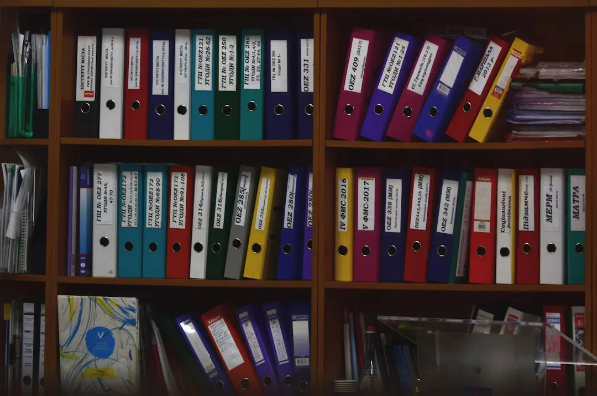
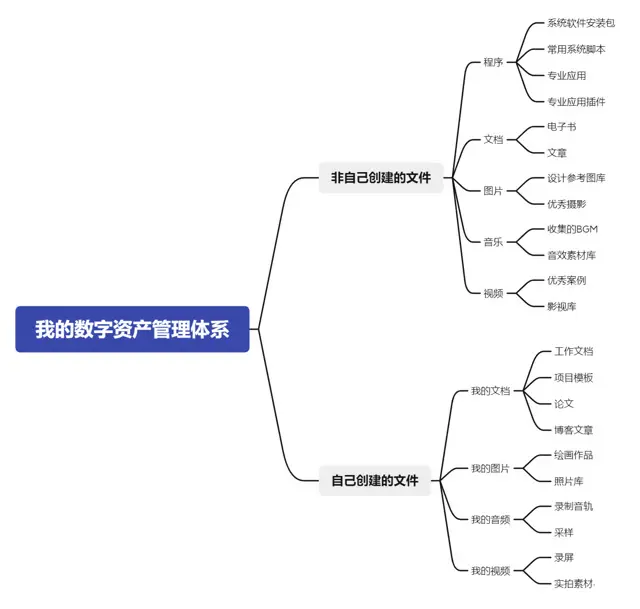

### 血的教训

我的机械硬盘又挂掉了一个，这是我记得用坏的第三块硬盘。让电脑忙着给我抢救数据的时候，觉得是时候总结下这方面的经验教训了。

很庆幸我在大学就养成了整理工程文件的习惯。本科念的动画专业，记得那个时候还是用 3DMax 做项目，max 有自己的一套文件管理体系，那时老师给我们讲解了规范文件命名和分类的重要性。现在想起来，这是在大学中为数不多让我感到受益终生的知识。

毕业到现在也快十年了，不论商业还是个人项目都接触了越来越多不同的领域，电视栏目包装，平面广告，舞台美术，潮玩，建筑漫游，UI，插画。。。如果在公司的话，一个健康的部门都有一套自己的文件管理规范，相对应的就是不同的推进流程。我从前年彻底转入自由职业，也开了自己的工作室，一人就是一支队伍，因此慢慢形成了一套适用于自己数字资产管理体系，不止于工作方面。

对这个管理体系我定下了几条宗旨：

- **非必要不增加分类**

前提是这个分类可以穷尽，例如文件类型无非是那么几种，但格式有无数种。

- **1 分钟内完成归档**

我见过很多人知道归档很重要，但能坚持一年的都很少，很多情况是刚做完工作已经很烦躁疲惫了，哪儿还有功夫费那个劲？其实真正做好了分类，1 分钟归档是水到渠成的事情。

- **尽量使用英文 + 日期数字命名**

这个算是专业上的习惯，因为很多专业应用都是只认英文路径，有的字体不支持中文会显示乱码。

- **重要文件每周冷热备份各一次 重要文件每周冷热备份各一次 重要文件每周冷热备份各一次**

可以不整理，请一定要备份，为了世界和平。

### 设计分类结构

我对文件的整理逻辑非常直接：

- 计算机中的文件只有两种：程序和数据。
- 我储存的文件都是数据。
- 这些数据要么是我参与创造的，要么是别人创造的。
- 所有数据最终都会输出为，文字，图像，声音，视频，这 4 种类型。
- 根据生活或工作的需求，再按不同的用途细分即可。

### 分类和搜索

这种管理思路其实是**分类优先**，还有一种是**搜索优先**。搜索的话我其实更习惯用在每个细分分类里，比如影视、音乐、电子书这些类型特别适合搜索。但图片就更适合分类，我用 eagle 来进行管理，有机会再写吧。自己拍的照片还是用 apple 自带的照片 App，已经很够用了。

让搜索产生优势的前提是要有规范的文件或路径命名，我的习惯确实能满足这个优势，但我平时真的没什么需求需要搜索什么文件，如果有文件丢了，那些专业应用也会自动提示它原来在哪个路径，而且通常情况是一丢一大片哈哈，但这已经不是搜索能解决的问题了。

但有一个地方我一定会用搜索，就是第二大脑，之前有写过 [打造第二大脑](/posts/build-the-second-brain/)。因为，在这里我不会强迫自己记住些什么，有分类也非常随意。

### 题外话

总的来说，这两种管理思路的方式其实就是 Notion 和 Obsidian 两款软件给我的启发。

Notion 对应的就是分类优先，需要你自己来搭建框架，前提是清楚自己每个方面的需求。只是它也有自己的底层规则，自由度相对较高。

Obsidian 则对应搜索优先，双链功能本质上更是提前做好了搜索，几乎是没有规则限制，更适合让输出的内容自由生长。

最后提两句，这个体系是我去年买了 NAS 做了一次彻底优化后的版本。实际情况嘛，目前来看勉强能 hold 住我的文件体量。管理的方法建议只参考思路，具体怎么做当然还是你自己开心最重要。不够好用的地方想办法继续优化它就行了，比如重复的操作是不是可以做一个模板？备份能不能做成增量备份？没有一步到位，也没有捷径。