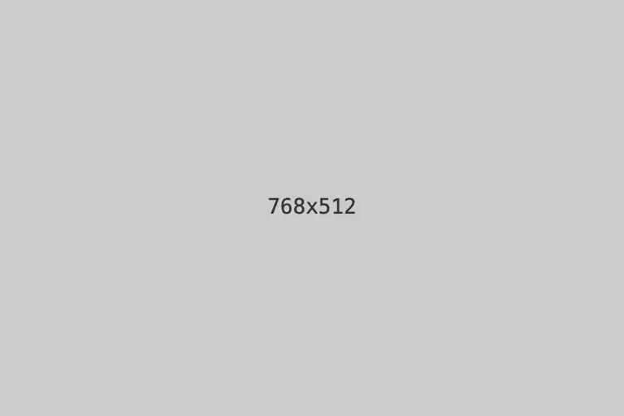

## 二级标题



这里是二级标题的内容

这是无序列表
- 列表1
- 列表2
  - 列表2-1
  - 列表2-2
- 列表3

这是有序列表
1. 列表1
2. 列表2
   1. 列表2-1
   2. 列表2-2
3. 列表3

这是代码块
```
console.log('Hello, world!')
```

这是代码块（带语法高亮）
```js
console.log('Hello, world!')
```

这是代码块（带语法高亮，语言为TypeScript）
```ts
console.log('Hello, world!')
```

这是表格
| 姓名 | 年龄 | 性别 |
| ---- | ---- | ---- |
| 张三 | 18   | 男   |
| 李四 | 20   | 女   |
| 王五 | 22   | 男   |

这是链接
[链接文本](https://www.example.com)

这是嵌入代码

::bilibili{id="BV1Af4Rz1EdS"}
