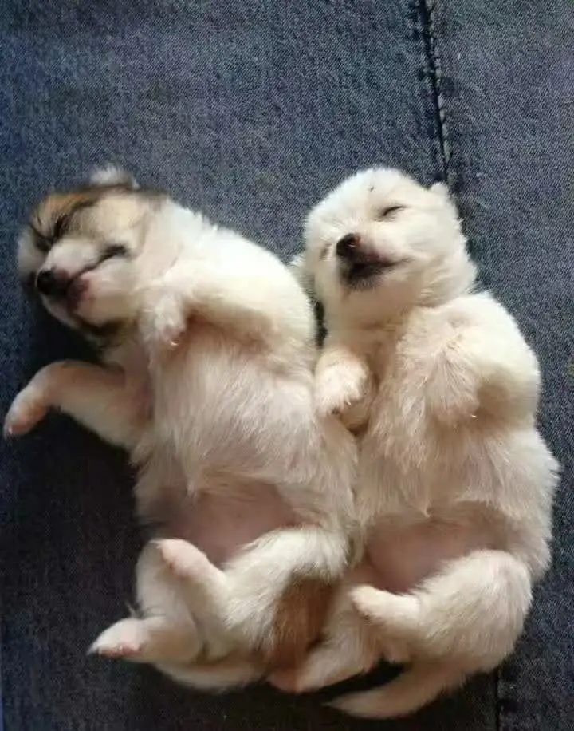

The other day I went downstairs to grab a meal. In the elevator, I ran into two neighbors walking a big golden retriever. Happily, I reached out and patted its head. The neighbor asked, "You like dogs, huh?" I smiled and nodded. Downstairs, they asked me to take a couple of photos of them with the dog. Everyone was happy. The dog — I have no idea.

People who've raised cats or dogs often snap photos and post them on social media, showing off their pet's happiness and, by extension, their own. From a human perspective, it's easy to think cats and dogs have it better than us — food delivered, and a dedicated servant to massage their paws and belly. I used to think so too. I even swore I'd be happy to be a cat or dog in my next life. Not anymore — that's why I said "swore." If you think about it a little deeper, the picture flips. A cat or dog's life is actually quite unfortunate. Whether life is happy depends on how many options you can say no to — your degree of freedom. A pet's life looks free, but it's freedom contingent on the owner's freedom. As a pet, your entire life's value lies in pleasing humans or being useful to them. The only thing a cat or dog can truly refuse is food. The owner's freedom places absolute constraints on the pet's freedom. In essence, this kind of life is being played with at someone's fingertips. The character for "palm" means hand, "thigh" means leg — pat your thigh and it climbs onto your lap, then stroke it with your hand. That's the literal meaning of "played with at your fingertips." More importantly, humans have the right to choose whether to surrender their freedom. Cats and dogs don't even have that option. You pet them when you're happy; them escaping your grasp is only because you chose not to force it. Once you do, they have no choice but to perform.

Dig one layer deeper: modern people need cats and dogs more for companionship. Ancient people needed them for their innate skills — guarding, tracking, hunting. And the very thing that most affects their freedom is precisely these "innate skills."

A cat's or dog's innate skills are inborn. A cat is born knowing how to catch mice. It can choose *which* mouse to catch, but it cannot choose not to be born with the ability to catch mice at all — that's hardcoded in its genes. It's also very difficult for cats and dogs to learn new skills. Sure, there are guide dogs trained to assist the blind, but if humans need them to be guide dogs, they can't refuse. Humans, on the other hand, are born with no innate skills. We have to learn even basic things like walking and talking. The reason human life is freer than a cat or dog's is that humans can choose *what* to learn as their craft. Catching mice? Professionals do it too, not just cats. A painter isn't born painting; a programmer isn't born coding. But a painter can choose to code, and a programmer can choose to paint. Humans have many ways to spend their lives. The more possibilities, the greater the freedom. A farmer in the mountains might never learn to fly a plane or become a director — the possibility is almost zero. But his child's chance of doing so is already greater than his from birth.

Go one layer deeper: after choosing your craft, another factor that affects freedom is *how well* you've mastered it. Truly mastering a craft takes a lot of effort. And it's not just about your own hard work — environment and opportunity matter too. The environment must not strip away your possibilities. Human freedom is reflected in having the opportunity to strive and the power to choose your direction. Your achievement is the result of your actions. The more your fate is shaped by your actions, the freer you are.

But a craft doesn't necessarily bring income. Someone who's great at raising dogs might not run a pet store. They can't make a living raising dogs — the dog might even eat their food. Because they're raising their own dog. Running a store means learning to raise other people's dogs, all kinds of dogs — that's a whole different skill. In other words, your craft may not have market demand. But whether it has demand or not, there's a side effect: once you possess a craft, you'll never see yourself as a useless person again.

Unemployment rates are high, the economy is tough. A lot of people feel worthless, like they're good for nothing. That has little to do with not finding a job. The root cause is having no real craft. If you have one, even if you can't make a living from it and might starve, you still have confidence in yourself. This kind of confidence is different from the kind you get from praise, awards, or career success. It's not indestructible in a magical way, but it's absolutely unshakable. Because something unique, even irreplaceable, has slowly taken shape within you. People without this confidence go looking for it everywhere. Someone says "learn English," so you learn English. Someone says "get this certification," so you go get it. At best, those are survival skills. Survival skills can get you a job and an income, but they can't give you the deep, identity-affirming confidence that comes from truly owning a craft.

Designing a building and building it as a construction worker feel completely different. You can't expect a construction worker to think they're contributing to the nation's development. But as a designer, you feel deep satisfaction and identification with your work. Because if a worker leaves, someone else replaces them immediately. If the designer leaves, the workers can't work either — at least not the same way. If Steve Jobs hadn't returned to Apple, the history of industrial design over the preceding decades would have been rewritten. Even if he never went back to Apple and ended up bankrupt and starving, he would have died deeply confident.

Confidence is also relative. People who seem extremely confident on the surface — whom everyone considers confident — may not have a true sense of certainty deep inside. They can't confirm their own value at the foundation level. But when you slowly learn to understand and master something genuinely difficult, pure confidence grows and consolidates. At that point, you no longer care about external judgment. What you care about is how deeply you understand the essence of the thing. Understanding complex things is, objectively, difficult.

A child can't solve a problem. The mother says, "You're already great, honey." Well-intentioned, but at best it soothes the child's emotions. Essentially, it's creating an illusion in the face of reality. The problem still isn't solved. The child's anxiety actually grows. Over time, this can lead to serious psychological issues. As the crosstalk comedian Guo Degang once said: you're worshipped at home, but one slap outside and you'll drop dead. Only when the child puts in the effort, struggles through, and solves the problem themselves — that's when anxiety eases and confidence grows. Unshakable confidence isn't built on praise or flattery. It's built by facing reality — deeper and deeper layers of reality — layer by layer, through ordeal.

The process of acquiring a true craft — survival skills won't cut it — is a process of repeatedly learning and understanding things that are inherently difficult to grasp. Repeatedly enduring pain, overcoming obstacle after obstacle — that's the fundamental way to build confidence. Because you know how hard the journey was. And you'll also recognize others who have real craft. You'll understand that anyone who has walked this path will recognize you too. They know the difficulty of the process.