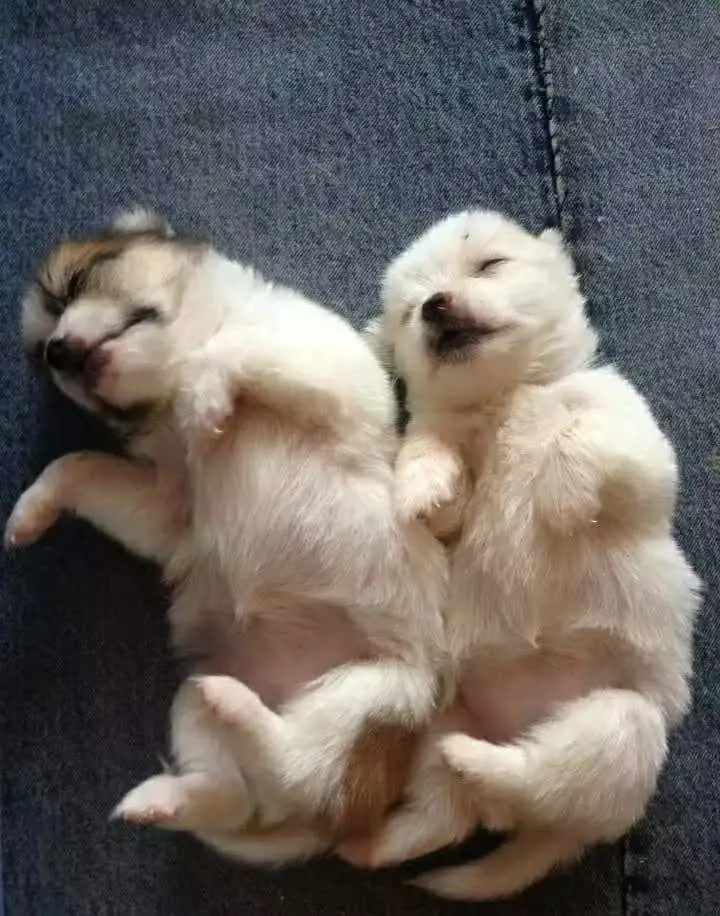

有天下楼吃饭，电梯里碰见俩邻居，领着一条大金毛，我挺高兴顺手摸摸狗头。邻居问我，喜欢吧，我笑着点点头，然后下了楼邻居还让我帮他们和狗拍了两张照片。人都挺开心，狗，我不知道。

养过小猫小狗的人，经常会拍照发朋友圈，晒出猫狗的幸福顺便晒出自己的幸福。从人的角度看，经常会认为猫猫狗狗的生活比人要幸福的多，饭来张嘴，还有铲屎官给亲自捏脸揉腿。我以前也这么认为，甚至会扬言下辈子做猫做狗也愿意，现在不是了，所以用了“扬言”。其实仔细往里想一层，事情就开始反转。猫狗的生活实际上是很不幸的。生活幸不幸福取决于你能拒绝掉多少选项，也就是自由度的高低。猫狗的生活，看起来很自由，实际是依赖于主人的自由之下，作为宠物，全部的生命价值都在取悦人类，或为人所用。猫狗真正唯一可以的拒绝选项只有绝食。主人的自由度对猫狗的自由度做出了绝对的约束限制，说白了这种生活，本质是一种被玩弄于股掌之上的生活。掌就是手，股是大腿，拍拍腿它就趴在腿上，再用手摸摸，是玩弄股掌之上的本意。更重要的事，人有选择是否让出自由度的权利，猫狗依然没这个选项。高兴了抱过来玩一会儿，能逃过一劫也是主人没有强制而已，一旦强制执行，只有被迫营业。

再往下深入一层想，现代人需要猫狗更多是需要它们陪伴自己，古代人需要猫狗是要用它们的守卫跟踪追捕这些看家本事，而最影响自由度的恰恰就是这“看家本事“。

猫狗的看家本事是天生的，猫生来会抓耗子，它能选择抓什么，但不能选择自己生来不会抓，这是基因里写死的程序。猫狗也很难再学新的看家本事了，当然也有导盲犬这种经过训练的狗，但只要人需要它当导盲犬，它没法选择拒绝。人天生没有看家本事，连走路说话都要后天慢慢学习。人的生命之所以比猫狗自由，因为人是可以选择自己学什么看家本事的，抓耗子，除了猫，也有专业人士负责干这个事儿。画家不会天生画画，程序员不会天生敲代码，但画家可以选择敲代码，程序员可以选择画画。人有很多种不同方式使用生命的可能性，这种可能性越大，自由度就越高。山里的农民，也许能学会开飞机当导演，他几乎没有学开飞机的可能性，但他的孩子开飞机的可能性生来就会比他爹要大一些。

再往下深入一层看。选了看家本事之后，影响自由度另外一个因素是这本事掌握的怎么样。真正掌握一门看家本事，是要下很多功夫的，而且不是你个人努力付出就完了，还要看环境和机缘，环境不会剥夺你的可能性，才满足条件。人的自由体现在，有努力的机会，有选择方向的权力，他最终的成就是他行为的结果。命运受行为的影响越大，就越自由。

不过，看家本事不一定能带来收入。比如养狗养得好的人，不一定靠开宠物店吃饭。他靠养狗是吃不了饭的，狗可能还会吃他的饭。因为养的是自己的狗，开店要学会养别人的狗，各种各样的小狗，这已经是另一门本事。也就是说，你的看家本事不一定有社会需求。但是，不管有没有需求，都会有一个副作用，就是当人一旦有了一样看家本事，他再也不会觉得自己是一个没用的人。

现在失业率降不下来，大环境不好，很多人会觉得自己一无是处，好像什么都不行，其实和找不到工作关系不大，根本原因是没有一样看家本事。如果有，就算不靠这个吃饭，会饿死，你也是对自己有信心的。这种信心和别人夸赞奖赏或者工作事业上获得的信心不同，不能说无坚不摧，但绝对坚不可摧。因为有某种独特的，甚至独一无二的东西，在你身上慢慢形成了。没有这种信心的人，会在别人那儿到处寻找，人家说好好学英语，你就学英语，人家说赶紧考这个证，你就去考这个证。那些顶多算混饭本事。混饭本事能让你找到工作，有收入，但没法让你获得对这门手艺高度认同的信心。

设计一栋房子，和工人盖这个房子，感觉一定不同。你不能指望工人盖房子还寻思自己是为了祖国建设做贡献，但如果你是设计师就会对自己的工作有深深的满足和认同。因为工人走了一个马上就有人替掉，设计师不干了工人立刻也没法干，起码干不成这个样子了。乔布斯不回到苹果，前几十年的工业设计历史就要改写，他就算回不到苹果公司，最后破产饿死了，是非常自信的。

自信也是相对的，表面上非常自信的人，别人都认为他很自信的人，内心深处不一定有对自己笃定的认同感，在对底层并不能确认自己的价值。但在你后天慢慢去理解掌握理解一个不容易理解的事物的时候，纯粹的信心会不断生长巩固。这时候你再也不需要关心外界的评价，你关注的是自己对事物的本质理解到了哪一步。理解复杂的事物，在客观上本身就有难度。

一个孩子做题做不出来，妈妈说你已经很棒了，虽然本意是好的，但最多只能缓解他的情绪，本质是在现实中给他制造幻觉。题照样做不出来，他的焦虑反而会放大，时间长了心理层面还可能会出大问题。就像老郭相声里讲的：在家里捧上天，出门挨一巴掌就得猝死。只有当小孩自己费点劲，下了功夫把题做出来才行。焦虑缓解了，信心也会增加。坚不可摧的信心不是听别人的夸奖，拍马屁建立的，只有不断面对真实，越来越深层次的真实，一层一层去磨练。

你在获得看家本事的过程——混饭本事没用，就是一次次去学习、理解那些本来难以理解的事物。一次次遭遇痛苦，历经重重障碍，才是从根本上建立信心的方法。因为你知道这个过程有多难。同样你也会更容易看出谁是有看家本事的，你也会很明白，凡是走到这里的人，他对你也一定会认同，他们也知道这个过程的难度。
