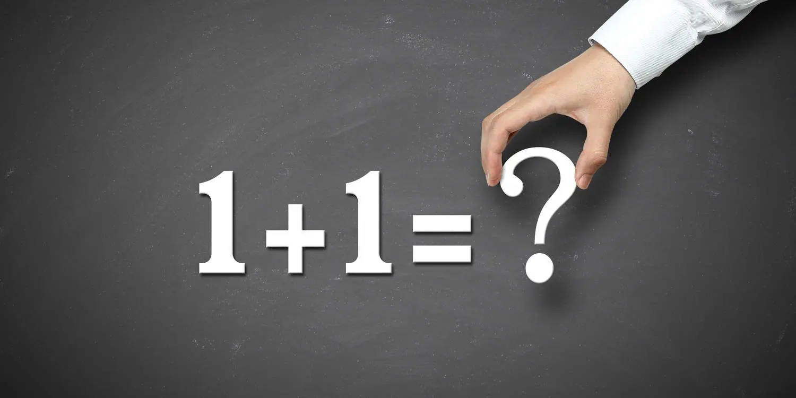
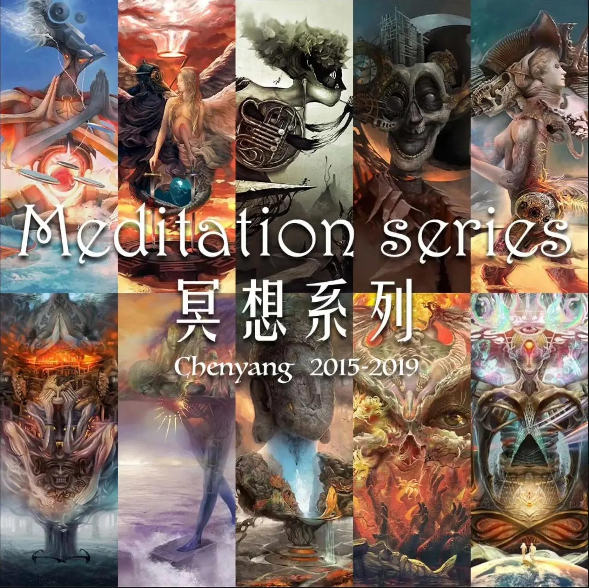

看网上聊到情绪，动不动就会讲到情绪管理。我不着急聊管理，连情绪是啥都没弄明白，有什么可管理的。

我自己画画的时候，肯定是有情绪有感受的，一笔笔都带着情绪感受直到把画完成。如果你去看我的画就很可能会猜，这人在画的时候估计情绪挺坏的，起码，不是好的。为什么会有这种判断？因为画面带给了你坏的感受，然后你做出了作者情绪也坏的判断，可即使作者的情绪再坏，你也不会看他的画有坏的情绪，除非他把你画丑了。

我画了很久，经历了很多事情才意识到，情绪和感受，是有区别的，更是不能混为一谈的。感受分身体上和心理上。人们讲，好的情绪，往往是用“好的感受”来描述，例如：开心，愉悦，兴奋，惬意…… 总之，不超过两种，身体的舒服和心理的舒服。

如果不用这些好的感受描述情绪，该如何定义“好情绪”呢？

很多人会不理解，怎么可以把感受和情绪分开谈？这是因为，如果二者混为一谈，人们会先入为主认为，感受是行动的动力，情绪只是个副作用。比如，有人骂我一句，我反手给他一闷棍。他骂我，让我产生不好的感受，这种不好的感受是我还手的动力。潜台词就是，我打他不是我主动的，他让我感受不好了，我是被动的，我别无选择，必须还手。

但现实中有太多的反例，太多的人，被骂也不会还手，不会骂还一笑而过，他能没感受吗。这就表示，感受不是行为的动力。感受只是遭遇的一种状态，被他人的行为影响到了，让我被处在了不好状态中，然后我生起了愤怒，愤怒的情绪才是做出那一闷棍的动力。

如果把感受和情绪混为一谈，就没法判断从遭遇感受到做出行动之间发生了什么。这会造成让人只顾得上去改变感受，并不能左右自己的行为。而实际上，影响感受的因素除了行为，还有处在的环境，感官接触的对象，当时的生理状态。只关注感受无视情绪和行为，是扬汤止沸。

所以，我们要剔除感受去理解情绪是什么。

坏情绪往往好理解一些，最常见的是愤怒。愤怒往往会让人意识不到自己到底做了什么，但就算这样，你当时给他测个血压，肯定也是比平时要高的。高了是说，相对于不愤怒的时候，血压产生了变化。可见，坏情绪是推动事物变化引发行为的一种力量。

问题是如果抛开感受，那好情绪是什么？抛开感受，坏情绪能让人血压升高，生病甚至死去，但好情绪只会让血压持续正常，并不会“更加正常”。一个开心的人，可以变得更加开心，绝不会变得“更加正常”。

这就是非常难以理解的一点：好情绪不是推动事物变化的动力，好情绪是一种承载力，只能代表人能承载多少坏情绪。比如绳子挂 100 斤东西断了，铁链挂 100 斤就没事儿，我们会说铁链比绳子要好。

两个员工都被领导叫进办公室被骂，被同一个人骂同一句话，一个会反击，一个会沉默。相同情境下的相同感受，不同的人会产生不同的情绪，这是无需多言的事实。拿出来讲是为了更好定义，什么是好情绪。

那么，我们可以用小学的数学知识继续分析。

如果设定从 - 9 到 - 1 代表坏情绪的级别，-9 是最坏的情绪，0 代表平静。-1 到 0 是比较微弱的坏情绪，姑且叫做负面情绪。

你会发现有的人坏情绪级别永远也到不了 - 9，顶多能到 - 5。那么我们可以说，-5 就是这个人的坏情绪承载极限，-5 到 - 9 的距离就是他的好情绪等级，也就是 4。

换句话说，一个好情绪等级为 4 的人，就算世界末日来了，他的情绪最坏也只到 - 5。

这里需要注意两点，第一，这人坏情绪等级会跟着感受随时变化，但好情绪等级依然是 4。这就好比他的肺活量是 5000 毫升，但不可能每次都呼吸 5000 毫升。也就是说，好情绪实际上是一种承载力，承载坏情绪的能力。

第二，这种承载坏情绪的能力也是会变的，还是像肺活量一样，短期内不变，不意味着永远不变，是有方法能学习锻炼的。

接下来我们看看极限情况，如果一个人好情绪为 0，也就意味着他的坏情绪是最坏能到 - 9，可能会做出毁天灭地的行为。但并不是说他这辈子一定能碰见让他达到 - 9 的境遇，大多数情况下其实都在 - 1 到 0 之间，普遍是负面情绪，甚至碰见好事能达到 0。0 就不能算做负面情绪了，在坏情绪为 0 的状态下生起的是平静，中性的情绪。但千万不要认为达到 0 之后，坏情绪会变成正数，好情绪不是坏情绪直接变来的，好情绪只有在坏情绪产生的时候才发挥作用。弹簧只有在被挤压的时候，你才会感受到弹力，这个弹力就好比好情绪。

很容易让人产生的另一个误解，认为好情绪是一种动力，推动着你去行动。比如我在努力画画，看起来确实动力十足，画着还挺开心。实际上，这是负面情绪伴随着好的感受一起出现而已，我是在发泄和排解负面情绪，这让我感受很好。一个战士准备斩杀仇敌的时候，他满腔怒火，会自然而然觉得自己是英勇的正义的，绝不会对身为人的同类产生同情和悲悯。如果他的愤怒值为 0，基本是下不去手的，更别说加上同情和悲悯。

如果一个人就算坏情绪能达到 -9，承载力为 0，他也一定体验过坏情绪为 0 的状态，也就是初生。这好比，一辆车就算载重为 0 人，是可以跑起来的。这种负面抗压能力是天生带来的，人人都有。其实，还像肺活量一样，后天锻炼的抗压能力就是从天生锻炼出来的。

那天生的抗压能力会改变吗？会。它既可以锻炼成后天抗压能力，也可以被破坏掉。什么时候会被破坏？在一个人根深蒂固地接受某些错误认知的时候。什么样的错误认知有这样的威力？据我所知，是生活经验与环境未曾有人告诉他，自己更不知道，认为犯错，重一点是作恶——不会导致受苦。这个反馈回路被生生截断了。认为知道犯错导致受苦这句话，没用，这不是知道，知道伸手碰火，手会疼，再也不会去碰，才叫知道。

这种认知会摧毁天生的负面抗压能力，当这个能力为 0 以后，他虽然也有负面情绪不生起的时候，但也只能生起中性的平静，绝对不会生起好情绪，也就是永远不会增强自己的负面抗压能力，直到开始怀疑自己的固有经验和认知。

最后留个问题，情绪和感受真的有好坏之分吗？