## 写在前面

去年购置了一台 NAS，但路由器还是用的单千兆网口，家里内网需要一台全千兆路由器来做数据交换。所以趁着优惠活动入了一台红米 AX6S 路由器，买之前我也没看什么攻略，更没有想到 200 多块的路由器居然隐藏了一个杀手级功能，在此记录下具体操作流程，这个流程理论上是通用各类路由器的，前提是网上能找到**相应可解锁的固件和计算 root 密码的方法，**2023 年相信这些都不是什么难题了，这里以红米 AX6S 举例。

## 准备工作

硬件：路由器，一根网线，一台可正常上网的 PC/Mac

软件：浏览器，下载安装 [Termius](http://www.termius.com/)，解锁固件文件

知识：有独立科学上网经验，了解基本的机场和 VPS 服务器使用方法。

## 解锁 SSH

💡

SSH 是两台计算机之间一种网络标准加密通讯协议。因为路由器实际上也是一台小型的计算机（拥有 CPU、内存、存储芯片），但市售的路由器一般都会隐藏 SSH 的功能，所以我们要先解锁它。

步骤如下：

1.  **刷入开发版本固件**

提前下载好安装版固件，我的这款红米 AX6S 对应的文件名是**miwifi\_rb03\_firmware\_stable\_1.2.7**

在浏览器窗口进入路由器后台，小米路由器地址默认是：192.168.31.1，输入后台管理员账号密码，每个品牌路由器可能不同。

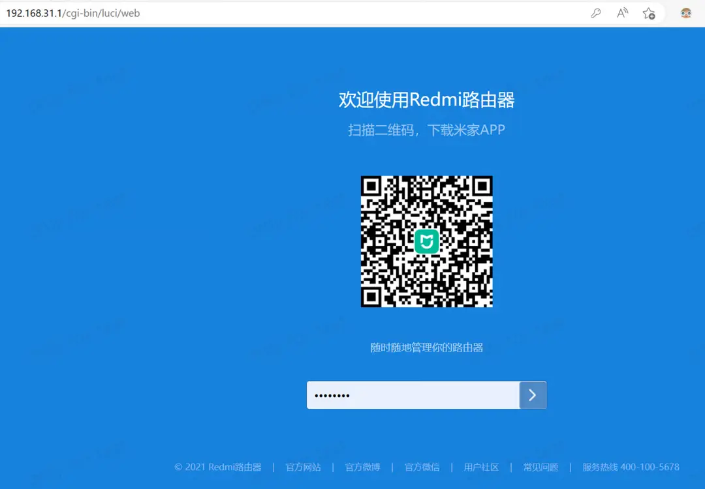

点击右上角用户名，选择“系统升级”

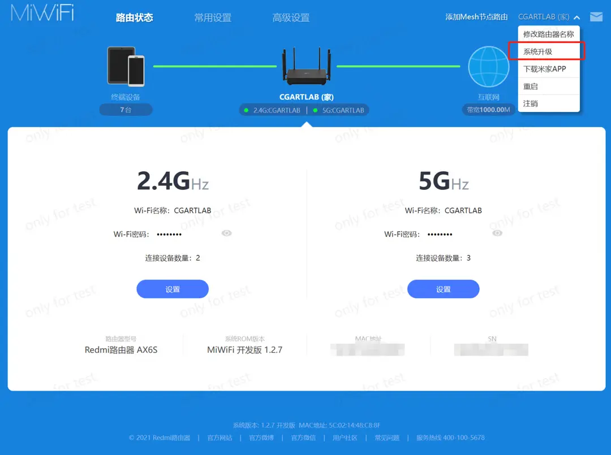

在升级检测一栏，选择手动升级，选择电脑里下载好的固件文件，点击开始升级，不用担心刷成砖头。

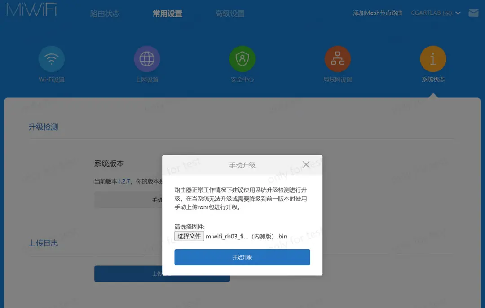

等待升级完成并重启，重新连接 WiFi 即可。

2.  **计算路由器 root 密码**

现在路由器的系统已经实际已经具备了 SSH 功能。我们需要根据每台路由器独有的 SN 号来计算登录密码，获取系统最高级权限。

计算密码的方法可以用线上网址，也可以用本地 html 文件，常见的路由器型号在 Github 或相关论坛上会有大神分享。我这里用的是本地 html 的方法。可直接使用：

[小米 SN](./_files/小米 SN.zip)

打开 html 文件，输入 SN 即可算出密码

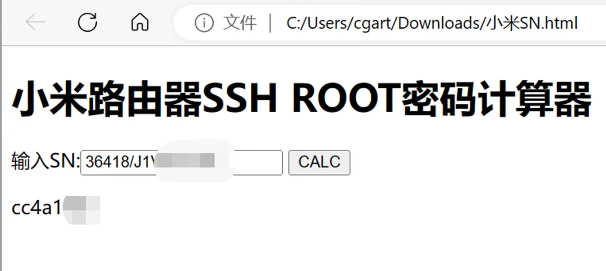

1.  **使用 Termius 开启 SSH**

Termius 是一个著名的跨平台的 SSH 客户端，操作对新手小白比较友好，我们需要的功能也完全免费。这一步高手可直接用电脑终端来操作。

安装不赘述，这是官网。

打开 Termius，跳过新手步骤，左栏选择 Hosts，点击 NEW HOST

其他参数如下图，Label 可以自己随意写，Address 填写路由器的 IP 地址，注意连接方式选**Telnet，**然后点击左边空白处保存。

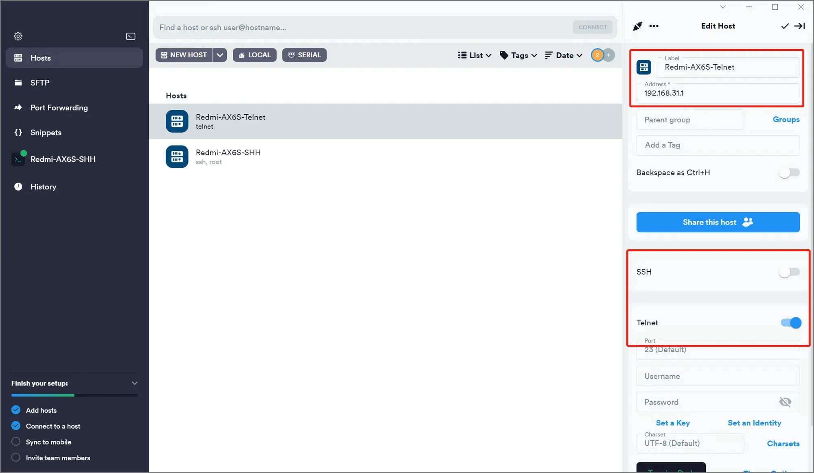

接着双击保存好的 Host 进行 Telnet 连接。（[Telnet 也是一种网络通讯协议](https://baike.baidu.com/item/TELNET/810597)）

-   login: root
-   password: 这里粘贴计算好的 root 密码（并不会显示，直接回车即可）


复制下面这段代码，即可开启 SSH 功能模块。

```js
nvram set ssh_en=1 & nvram set uart_en=1 & nvram set boot_wait=on & nvram set bootdelay=3 & nvram set flag_try_sys1_failed=0 & nvram set flag_try_sys2_failed=1
nvram set flag_boot_rootfs=0 & nvram set "boot_fw1=run boot_rd_img;bootm"
nvram set flag_boot_success=1 & nvram commit & /etc/init.d/dropbear enable & /etc/init.d/dropbear start
```

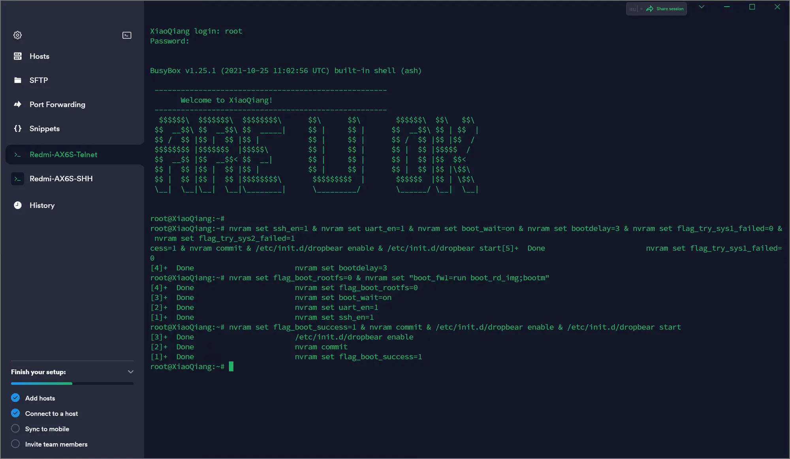

4.  **登录 SSH**

再新建一个 Host

-   Address 填写：192.168.31.1
- 勾选 SSH，关闭 Telnet
-   SSH 用户名填写：root
-   Password 粘贴之前计算的 root 密码

点击右上角箭头，然后刚新建的这个 Host，选择使用 SSH 方式连接。

出现这个界面就代表你成功一大半了！

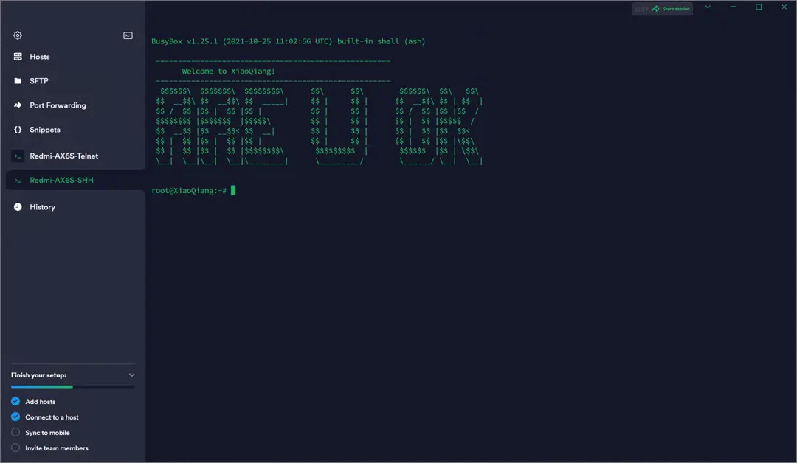

## 安装和配置 ShellClash

>[!note] 不知道什么是 Clash 的朋友可以自行百度了解一下。

ShellClash 就是 Clash 的一个变体版本，支持运行在各种路由器系统和 Linux 环境下，具体介绍看这里：

### 安装

在 SSH 的 Host 里面直接粘贴下面的命令，就可以安装 ShellClash 了。

```javascript
export url='https://raw.fastgit.org/juewuy/ShellClash/master' && sh -c "$(curl -kfsSl $url/install.sh)" && source /etc/profile &> /dev/null
```

- 选择“2”稳定版
- 然后输入“1”确认安装（我这里就不覆盖安装一次了）

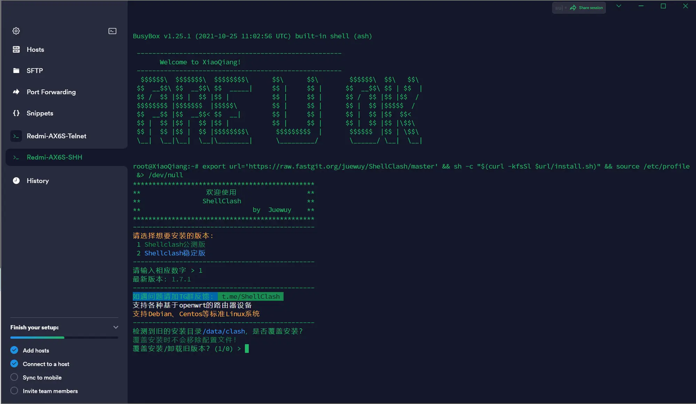

### 配置 Clash

安装好后我们继续输入 Clash，回车。

- 选择 1 主机或旁路由
- 选择 1 不代理 UDP

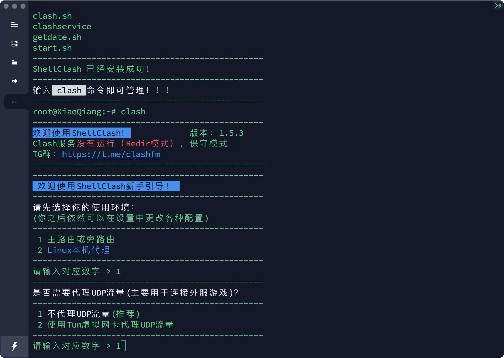

为避免每次设置 Clash 都需要打开 Termius，我们需要安装一个软件界面，也就是本地 Dashboard 面板。

- 选择 1 安装 Dashboard 面板
- 选择 YACD 面板（这里的序号可能会不同）
- 选择 1 /data/clash/ui 目录安装

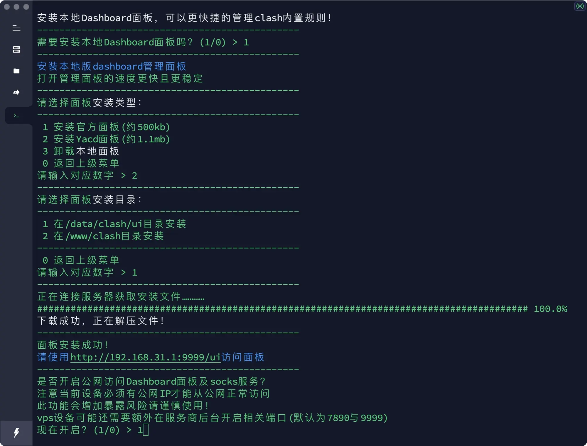

安装好后我们选择 1 开启公网访问服务

- 选择 1 开始导入
- 选择 1 在线生成配置文件
- 粘贴你的订阅链接（你的机场或 VPS 服务商会提供）

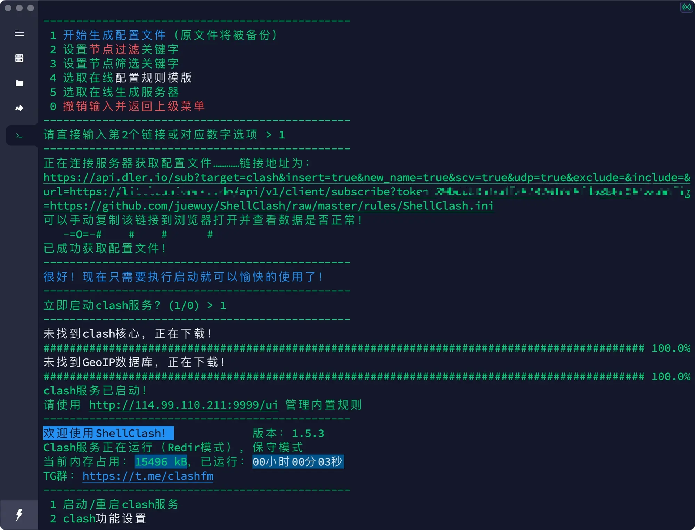

如果能坚持看到这里，相信你对机场和 VPS 服务器也有所了解。

- 选择 1 开始生成配置文件
- 选择 1 立即启动 Clash 服务
- 选择 0 退出脚本

不出意外的话，现在你的 ShellClash 已经可以正常使用了。

在浏览器打开 `http://192.168.31.1:9999/ui` 路由器 IP 地址，就能访问你的路由器 Clash 后台。

没有其他需求的话，建议关闭路由器的固件更新。

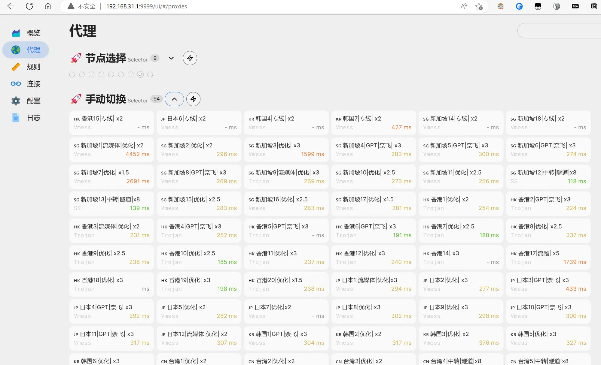

## 总结

至此，你的全屋设备只要通过这个路由器上网，那么你这台设备就是“科学的”，通过手机或平板的浏览器也可以随时切换不同的节点，这是我目前使用过的最科学的上网方式。

祝你好运！

## Weekly Highlight

这周开始尝试使用 TimeBlock 的时间管理方式，之前看了网上各种关于时间管理的介绍，一直以来的印象都是：

“哇…不至于做到这个地步吧？”

“感觉活的像个机器人一样”

直到我自己的商业项目，各种生活杂事越来越多，导致频繁的焦虑不安之后，我决定尝试一下，感觉真的不错，具体的做法我参考了这篇文章：

我按照自己的情况用 iCloud 日历制作了一个版本，然后把这个日历同步到了我的所有设备。

当然你可以按照自己的习惯创建属于你的版本，用什么工具不重要，最开始只用手机自带的日历都可以。

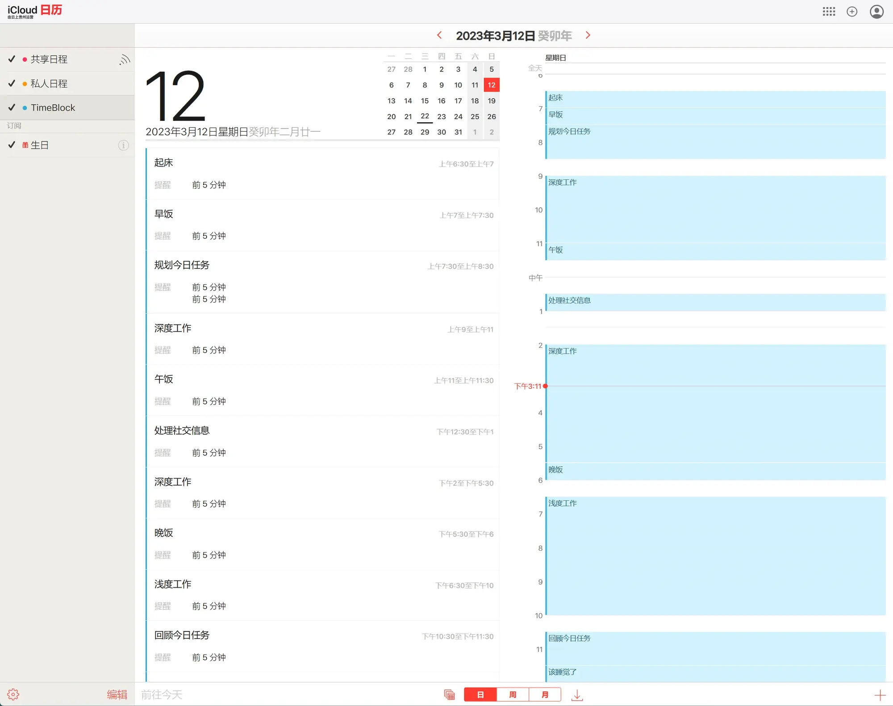

忘记在哪里看到的一句话：

> 如果你不试图控制自己的时间，你就会被时间控制。

下周…见？
