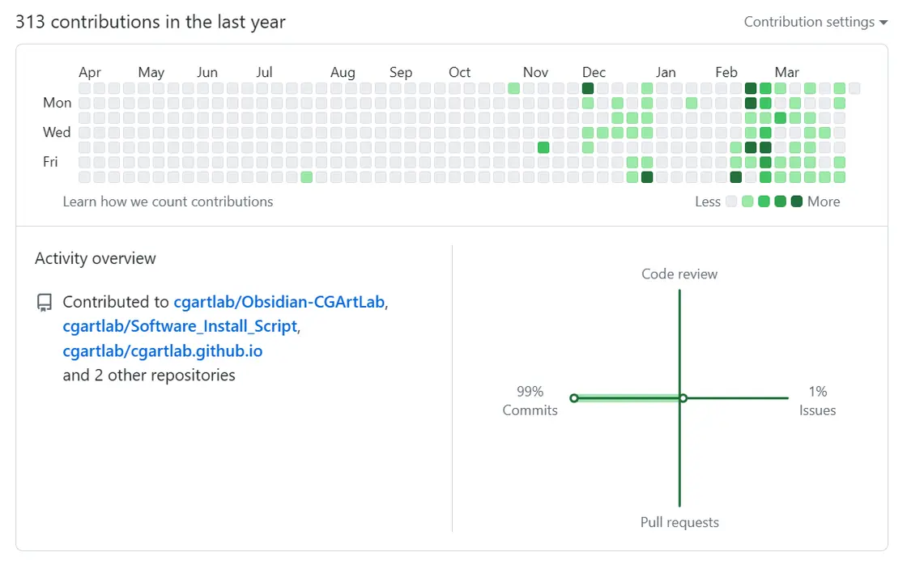
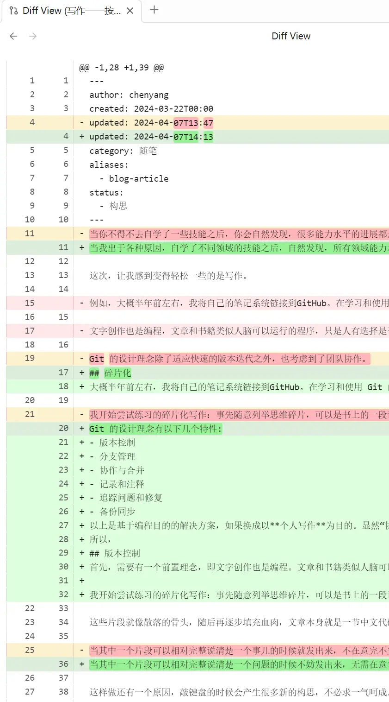
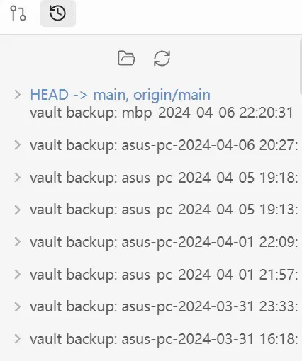

## Foreword

Learning a craft on your own is like "crossing the river by feeling the stones."

After learning several different crafts, you'll clearly feel that progress in almost any field is very slow, including drawing, design/animation, video editing, coding, writing, fish keeping, gardening, cooking. However, there's usually a certain threshold - once you slowly climb over it, things feel easier.

Before reaching that threshold, you're still "finding stones." When you feel easier after climbing the threshold, you've "found some stones" and vaguely discovered some patterns in how these "stones" are arranged.

What made me feel easier this time is writing - writing has started to feel like building a thinking specimen.

## Revisiting Fragmentation

Previously in [Relaxed Reverse Brainstorming](https://cgartlab.com/posts/relaxed-reverse-brainstorming/) and [Building the Second Brain](https://cgartlab.com/posts/build-the-second-brain), I discussed the dangers of fragmented information. But fragmentation itself isn't worthless. I thought, **since it brings a sense of stress relief when acquiring information, why can't it do the same during creation?**

To realize this idea, I have to thank the great [Git](https://git-scm.com/). Because Git is currently the most advanced **fragmented creation system** I've used.

About half a year ago, I linked my note system to GitHub, where every modification and improvement has complete records and backups. While learning and using Git, I gradually understood Git's design philosophy. Afterwards, I started having new insights about creation, project management, and workflow optimization. I'm certainly not a professional programmer, but through various opportunities, participating in multiple app development experiences made me realize that programming world thinking patterns also apply to writing. (Oh, by the way, calligraphy doesn't count as writing - it still belongs to visual creation, which I categorize with drawing.)

## Git's Design Philosophy

Git's design philosophy has the following characteristics:

- Version Control
- Branch Management
- Collaboration and Merging
- Recording and Annotation
- Issue Tracking and Fixing
- Backup and Synchronization

These are solutions based on programming purposes. If we switch to **personal writing** as the goal, obviously "Collaboration and Merging," "Recording and Annotation," "Issue Tracking and Fixing" can be temporarily ignored. The reason is simple - currently we're **not running an editorial department**. The main purpose of writing is still to record our own thinking process.

So, we only need to focus on:

- Version Control
- Branch Management
- Backup and Synchronization

Before deeper analysis, there needs to be a preliminary concept: **text creation is also a form of programming**. Articles and books are like programs that human brains can run, the difference being that humans have the freedom to choose whether to execute them, while machines have no choice.

I found that viewing from this angle makes it easier to understand.

## Version Control

Git's basic management unit is a "repository," which can be simply understood as a project folder.

Version control is the core of Git's most important design philosophy - essentially completely recording all changes that occur within this project folder.

Like Git, you can use version control systems (such as Git itself, GitHub, GitLab, etc.) to track your document versions. After each edit or major modification, commit a new version so you can roll back to previous versions anytime. It can be said that in Git, there's no concept of "deletion." Like Time Machine on Mac, you can revert to any moment and naturally add back previously deleted content anytime.

## Branch Management

Git's branch management function can help you try new ideas, structures, or styles during the writing process without affecting the main document version. You can create new branches for experimental modifications, then merge them back to the main branch as needed, or keep branches as alternative solutions.

Besides the creation phase, it can also be used in the distribution phase.

For example, when the content you want to write needs to be published on different platforms, you can completely create different branches based on different platforms' reader characteristics, rather than creating multiple versions under the main branch.

Currently, I haven't used too many branch management functions because the publishing platforms are limited to [personal website](https://cgartlab.com/), [xlog](https://cgartlab.xlog.app/), [Zhihu](https://www.zhihu.com/people/asky1992), and the quantity is still manageable.

## Backup and Synchronization

As the name suggests, you can record, organize, and improve text content on any platform at any time. In Git, you can push repositories to remote servers, or choose to build your own server to synchronize writing progress between different devices and use it as backup storage. This way, even if your local computer is damaged or lost, your writing content remains safely stored in remote repositories.

## Fragmented Writing

In my view, fragmented writing of an article is building a thinking specimen.

After viewing an article as a specimen, through continuous exploration and experimentation, the steps I've practiced so far are roughly:

- Collecting Bones
- Building the Skeleton
- Assembling the Whole
- Continuous Improvement

## Collecting Bones

Casually list thinking fragments in advance - topics you're interested in writing about. It could be a passage from a book, a chat reply, or even two or three words. For example, the theme of this piece was a flash of inspiration while sitting on the toilet after waking up. This is the "first bone."

Five days later, when enough bones are collected, formally create a draft and decide to finish writing it.

If an article is like a living creature, these fragments are scattered bones, subsequently to be filled with blood, constituting a segment. A segment itself is a "Chinese code snippet," naturally capable of version iteration.

Only during the bone phase, be patient - bones can't grow by themselves, all waiting to be assembled. If you're in a hurry today, it's not necessary to form something complete - it can also be a four-armed bone. As a result, take a bone and see what it looks like, then see if it might belong to the head, body, or arms. During this process, many questions may prompt you to find related information. No need to force yourself to write completely.

Not forcing yourself to write completely has another reason. Typing on the keyboard produces many new concepts - it's not necessary to write everything in one go. Without moving your hand to write, you can't think of how many ideas you'll have, sometimes even reaching the end of words. Actually, like drawing, give yourself some free strokes - it's not necessary to draw completely. Slowly, these segments - some need to be merged, some need to be decomposed. Finally, weave a net with logical connections, resulting in the construction of the fish's body and head.

When a particular segment can relatively completely explain a small problem clearly, it actually already meets the conditions for short text. At this point, don't worry about whether the wording is beautiful, just ensure:

- Sentences are smooth without typos, with basic readability.
- Clear viewpoints and thinking.

When these small fragments reach a certain scale, you can try building the skeleton.

## Building the Skeleton

Bones of course need to be assembled into a skeleton to be worth looking at. The so-called skeleton is the article's table of contents.

Organizing the table of contents is the process of assembling various parts into a complete form. If you're not writing poetry or prose, you must pay attention to whether the arrangement of section headings follows basic logic. Otherwise, this "skeleton" won't be sturdy enough to withstand scrutiny.

Here are two approaches you can reference:

- **Architect Mindset**: If your mind works faster, you might have clear major chapter planning from the beginning, then you've likely already entered the skeleton-building phase.
- **Archaeologist Mindset**: You prefer starting from a certain part, even just a "bone," slowly uncovering the complete picture of the content.

There's no superiority or inferiority between these two approaches - each has its advantages and disadvantages.

## Assembling the Whole

Assembly means the overall content framework already allows people to see what "species" your thinking specimen belongs to - whether it flies in the sky or runs on the ground. That is to say, there must be a theme that can unify the whole.

For example, the unifying theme of what you're reading now is clearly not "Git," not "thinking specimen," but "fragmented writing."

Completeness means if this thinking specimen is a bird, it must have wings and feathers; if it's a fish, it must have scales and gills. That is to say, it must contain topics directly related to the theme.

Only when completeness is achieved can we talk about improvement.

## Continuous Improvement

Improvement means improving the perspective of explanation, the quality and quantity of examples, etc., not nitpicking word choices and tone of a single sentence - leave that to computer automatic grammar and spelling checks.

I particularly like what Haruki Murakami said:

> Loosen screws that are too tight, tighten screws that are too loose.

Overall, fragmented writing is like an art of building thinking specimens. It not only allows me to concurrently handle N creative ideas, but also more systematically capture and organize my thinking, transforming it into long-lasting text content.

In this process, I can continuously improve my writing ability while deepening my understanding and cognition of the creative process.

Improvement, not perfection.

Viewed individually, any life form is imperfect. Imperfection makes sustainability possible.

Viewed as a whole, what's perfect is the evolutionary process - every subtle decision life makes from changing conditions to changing evolutionary directions.

Nature has been demonstrating what the best creative state is since the beginning of creation.

---

Article first published at: [CGARTLAB](https://cgartlab.com/), welcome to [free email subscription](https://weelly.cgartlab.com).
