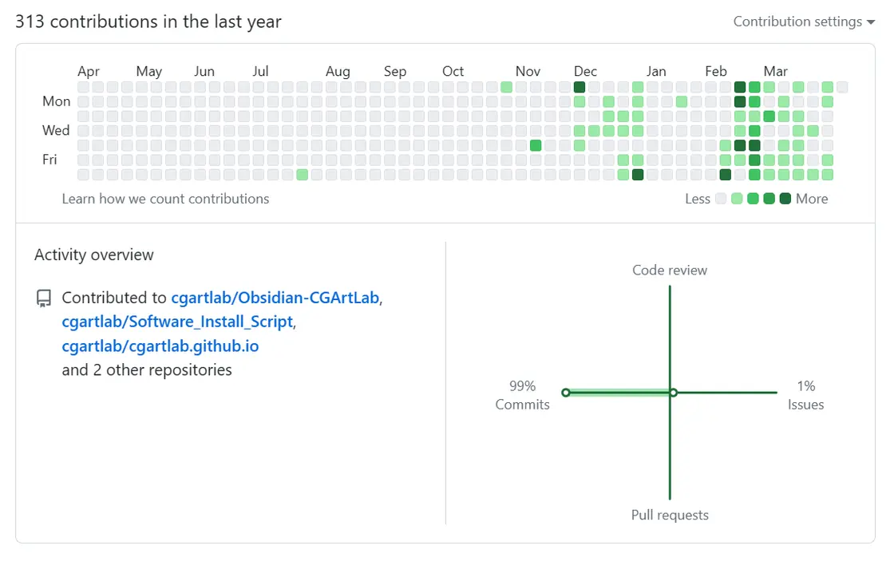
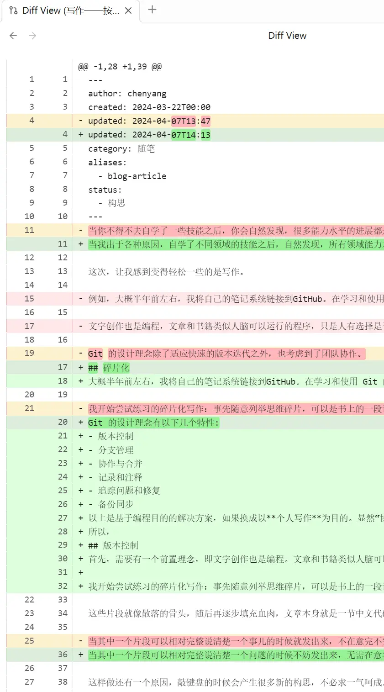
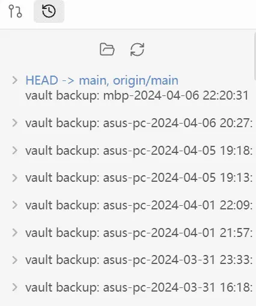

## Foreword

Learning a craft on your own is like "crossing the river by feeling the stones."

After dabbling in several different fields, you'll clearly feel that progress in almost any area is very slow—drawing, design/animation, video editing, coding, writing, fish keeping, gardening, cooking all included. However, there's usually a threshold somewhere; once you slowly climb over it, things start to feel lighter.

Before reaching that threshold, you're still "finding stones." Once you've climbed over it and feel lighter, you've "found a few stones" and vaguely discovered some patterns in how these "stones" are arranged.

What made me feel lighter this time is writing—writing has started to feel like building a thinking specimen.

## Revisiting Fragmentation

Previously in [Relaxed Reverse Brainstorming](https://cgartlab.com/posts/relaxed-reverse-brainstorming/) and [Building the Second Brain](https://cgartlab.com/posts/build-the-second-brain), I discussed the dangers of fragmented information. But fragmentation itself isn't worthless. I thought, **since it brings a sense of relief when acquiring information, why can't the same apply to creation?**

To realize this idea, I have to thank the great [Git](https://git-scm.com/). Git is the most advanced **fragmented creation system** I've ever used.

About half a year ago, I linked my note system to GitHub, so that every modification and improvement has complete records and backups. While learning and using Git, I gradually came to understand its design philosophy. Afterwards, I started gaining new insights into creation, project management, and workflow optimization. I'm certainly not a professional programmer, but through a series of opportunities, participating in several app development experiences made me realize that the thinking patterns of the programming world also apply to writing. (Oh, by the way, calligraphy doesn't count as writing—it still belongs to visual creation, which I categorize with drawing.)

## Git's Design Philosophy

Git's design philosophy has the following features:

- Version Control
- Branch Management
- Collaboration and Merging
- Recording and Annotation
- Issue Tracking and Fixing
- Backup and Synchronization

These are solutions built for programming purposes. If we shift the goal to **personal writing**, then obviously "Collaboration and Merging," "Recording and Annotation," and "Issue Tracking and Fixing" can be temporarily ignored. The reason is simple—we're **not running an editorial department** here. The main purpose of writing is still to record our own thinking process.

So, we only need to focus on:

- Version Control
- Branch Management
- Backup and Synchronization

Before going deeper, there's a prerequisite concept: **text creation is also a form of programming**. Articles and books are like programs that human brains can run; the difference is that humans have the freedom to choose whether to execute them, while machines have no choice.

I found that viewing things from this angle makes them much easier to understand.

## Version Control

Git's basic unit of management is a "repository," which can be simply understood as a project folder.

Version control lies at the heart of Git's design philosophy—essentially, it completely records every change that occurs within this project folder.

Like Git, you can use a version control system (such as Git itself, GitHub, GitLab, etc.) to track your document versions. After each edit or major modification, commit a new version so you can roll back to any previous version whenever you need. It can be said that in Git, there's no concept of "deletion." Just like Time Machine on macOS, you can revert to any moment and, of course, add back previously deleted content at any time.

## Branch Management

Git's branch management lets you try new ideas, structures, or styles during the writing process without affecting the main version of your document. You can create new branches for experimental revisions, then merge them back into the main branch as needed, or keep branches around as alternative versions.

Beyond the creation phase, branch management is also useful in the distribution phase.

For example, when the content you want to write needs to be published across different platforms, you can simply create different branches tailored to the characteristics of each platform's readers, rather than maintaining multiple versions under the main branch.

Currently, I haven't made heavy use of branch management, because the publishing platforms are limited to [personal website](https://cgartlab.com/), [xlog](https://cgartlab.xlog.app/), and [Zhihu](https://www.zhihu.com/people/asky1992), and the count is still manageable.

## Backup and Synchronization

As the name suggests, you can record, organize, and refine text content on any platform at any time. In Git, you can push your repository to a remote server, or even set up your own server, to synchronize writing progress across different devices and use it as backup storage. This way, even if your local computer is damaged or lost, your writing remains safely stored in the remote repository.

## Fragmented Writing

In my view, writing an article in fragments is like building a thinking specimen.

After treating an article as a specimen and going through repeated trial and error, the steps I've practiced so far are roughly:

- Collecting Bones
- Building the Skeleton
- Assembling the Whole
- Continuous Improvement

## Collecting Bones

Start by casually listing thinking fragments—topics you're interested in writing about. They could be a passage from a book, a chat reply, or even two or three words. For example, the theme of this very piece came from a flash of inspiration while sitting on the toilet just after waking up. That was the "first bone."

Five days later, once enough bones had been collected, I formally created a draft and decided to finish writing it.

If an article is like a living creature, these fragments are scattered bones—combined together, they form a segment. A segment itself is a "code snippet," naturally amenable to version iteration.

In this bone-gathering phase, you need to be patient: a single bone won't grow on its own; they're all waiting to be assembled. If you're eager to have something finished today, you don't have to assemble it into a complete creature—it could still be missing limbs. The result is this: take out one bone and see what kind of bone it looks like, then see whether it might belong to the head, the body, or an arm. In this process, many questions will drive you to look up related information. There's no need to force yourself to write it all in one sitting.

There's another reason not to force yourself to write it all in one sitting. Typing on the keyboard gives rise to many new ideas—you don't have to finish everything in one go. If your hands stay still and you don't write, you'll never know how many thoughts you actually have—sometimes you'll even be unable to stop writing. It's actually like drawing: give yourself some free strokes, no need to finish in one go. Slowly, these fragments accumulate—some need to be merged, some need to be split apart. Finally, weave a net, link them through logic, and the result is a fish's body, complete with head and torso.

When a particular fragment can relatively completely explain a small problem, it actually already meets the conditions for a short piece of writing. At this point, don't worry about whether the wording is elegant—just make sure:

- Sentences flow smoothly without typos, with basic readability.
- Clear viewpoints and thinking.

Once these small fragments reach a certain scale, you can try to build the skeleton.

## Building the Skeleton

Bones, of course, need to be assembled into a skeleton to be worth looking at. The so-called skeleton is the article's table of contents.

Organizing the table of contents is the process of assembling various parts into a complete form. If you're not writing poetry or prose, you must pay attention to whether the arrangement of section headings follows basic logic. Otherwise, this "skeleton" won't be sturdy enough to withstand scrutiny.

Here are two approaches you can consider:

- **Architect's Mindset**: If your mind works quickly, you may have clear, well-defined plans for the major chapters from the start—in which case you've likely already entered the skeleton-building phase.
- **Archaeologist's Mindset**: You prefer to start from a particular part, even just a single "bone," gradually uncovering the full picture of the content.

Neither approach is superior to the other—each has its own strengths and weaknesses.

## Assembling the Whole

Assembly means the overall framework of the content already lets people see what "species" your thinking specimen belongs to—whether it flies in the sky or runs on the ground. In other words, there must be an overarching theme that unifies the whole.

For example, the unifying theme of what you're reading now is clearly not "Git," nor "thinking specimen," but "fragmented writing."

Completeness means that if this thinking specimen is a bird, it must have wings and feathers; if it's a fish, it must have scales and gills. In other words, it must include topics directly related to the theme.

Only when completeness is achieved can we talk about polish.

## Continuous Improvement

Improvement means refining the angle of explanation, the quality and quantity of examples, and so on—not nitpicking the wording and tone of a single sentence. Leave that to your computer's automatic grammar and spell checker.

I particularly like what Haruki Murakami said:

> Loosen screws that are too tight, tighten screws that are too loose.

All in all, fragmented writing is an art of building thinking specimens. It not only lets me juggle N creative ideas at once, but also helps me more systematically capture and organize my thinking, transforming it into long-lasting written content.

In this process, I can continuously improve my writing ability while deepening my understanding of the creative process.

Improvement, not perfection.

Looked at individually, every life form is imperfect. Imperfection is what makes sustainability possible.

Looked at as a whole, what's perfect is the process of evolution—every subtle decision life makes as conditions change and evolutionary directions shift.

Since the dawn of creation, nature has been demonstrating what the best creative state looks like.

---

Article first published at: [CGARTLAB](https://cgartlab.com/)—welcome to [free email subscription](https://cgartlab.com/weekly/).
