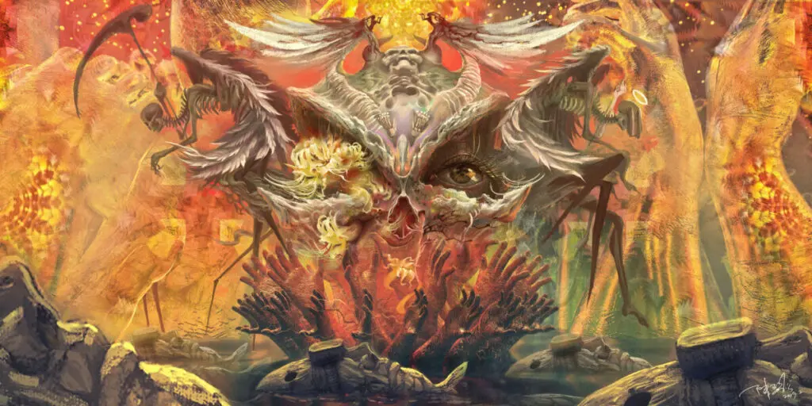
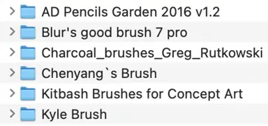
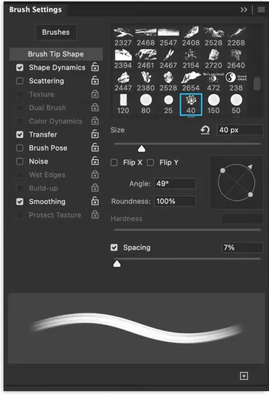

## Introduction

Recent work has been leaning more towards painting direction, and driven by my instinctive love for painting, I've had many thoughts on the subject.

This article discusses brushes and strokes.

Brushes can be considered essential tools for CG art creation and concept design. The internet is flooded with countless downloadable and purchasable brushes. Combined with the popularity of iPads and Apple Pencils in recent years, which have almost lowered the barrier to CG painting to its minimum, the choice of brushes has become an unavoidable question for beginners entering CG painting. A common mistake many novices make is seeing a beautiful painting, falling in love with it, and instead of asking how a particular part was painted, they ask what brush the master used and where to download it. It's like tasting a delicious dish and instead of asking the chef when they added water or turned up the heat, asking whether they used charcoal or gas, or whether the water was tap water or bottled water.

## Brush

The three basic properties of brushes:

- **Shape**: The brush shape can be understood as the shape of the brush tip. For example, pencils are generally round, while oil painting brushes are typically square.
- **Texture**: Texture is essentially a collection of shapes. In digital software, it can also be set as paper texture to simulate the feel of painting on different types of paper.
- **Opacity**: As the name suggests, this refers to the intensity of the above two properties, generally used to create new textures through multiple overlapping strokes.

There are many other properties in different software, such as smudge, random colors, jitter, etc., but these are all derived from these three basic properties through program parameter control, with the sole purpose of improving efficiency.

I personally have about 7-8 sets of saved brushes, totaling over a thousand. But despite the variations, they all share the same essence. The fundamental nature of every brush is the arrangement and combination of shape and texture units.

In my CG painting creation process, a single painting rarely uses more than 5 different brushes. Classified by shape, it's even fewer - just square and round. Why is this? There are two reasons:

First, the shape of any object can be summarized and categorized using these two shapes. For example, human heads are round, houses are square, tree trunks and leaves are round plus square. In most cases, these two are sufficient.

Second, having fewer brushes forces you to focus more on other important aspects like composition, contrast relationships, and design, rather than obsessing over which brush effect works best for a particular object.

So, understanding this, we've basically covered brushes. But there's another related term called stroke.

## Stroke

Brushes are tools for replicating shapes, while strokes are the traces left by the brush - techniques that convey emotion and texture.

Novices care more about brushes, while masters care about strokes. To become a master, spend more time contemplating strokes. Those who play with strokes are the true masters.

The properties of strokes are very simple: large, small, long, short.

Large strokes are stable and bold, small ones are delicate and smooth, long ones flow naturally, short ones are mottled and urgent.

We can see that strokes can carry the unique emotions of painting, as well as the texture of the artwork.

By combining these size and length properties with your painting subject, endless variations become possible. For example, when painting a girl's long hair, the conventional approach uses long strokes to express the flowing, graceful quality of the hair. For male hair, short strokes are generally used for a clean, sharp effect. But can we reverse this? What effect would using short strokes for long hair create? What emotion would using round shapes to represent long hair convey? This is exactly what art should explore.

Some painters also use techniques to hide strokes. Their purpose is to prevent you from feeling their subjective emotions, making you focus solely on the subject they're painting. This is most common in classical oil paintings and church murals. In modern art, Mondrian took this to the extreme. Other painters care more about strokes, essentially to preserve their emotions - like Van Gogh, with Chinese ink painting taking this to its ultimate expression.

Therefore, mastering strokes is truly very difficult.
