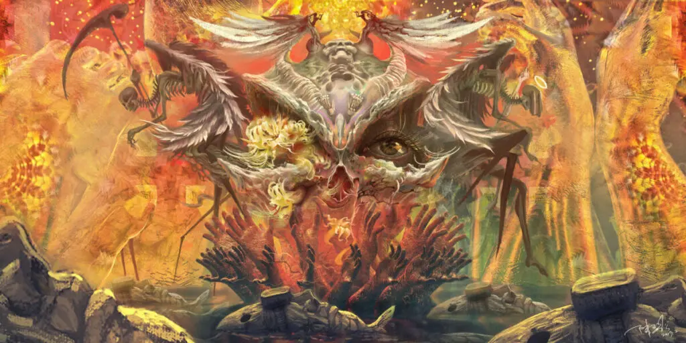
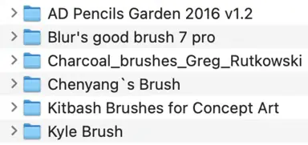

## 写在前面

最近的工作绘画方向偏多，也是出于对绘画爱好的本能，产生了很多思考。

这一篇聊聊笔刷和笔触。

笔刷（Brush）可以说是从事 CG 艺术创作和概念设计的必备工具。网络上各种可以下载和购买的笔刷更是多如牛毛。再加上近两年风靡的 iPad 和 Apple Pencil，把 CG 绘画门槛几乎降到了最低，使得绘画时采用什么笔刷，成了入门 CG 绘画的一个躲不开的问题。很多新手容易犯的一个毛病就是看到一张好画，爱的不行，然后一上来不是问这一块是怎么画的，反而问大佬你用的什么笔刷呀？哪里可以下载呀？就好像吃到一个很好吃的菜，然后不问厨子什么时候加的水开的大火，反而去问他用的火是炭火还是燃气，水是自来水还是农夫山泉。

## 笔刷

笔刷的三个基本属性

- 形状 笔刷的形状其实可以理解为笔尖的形状，例如铅笔一般为圆形，油画笔一般为方形。
- 纹理 纹理其实是形状的集合，在电脑中也可以设置成纸张的纹理用来模拟在不同纸张上绘画的质感。
- 透明度 顾名思义就是上面两种属性的强度，一般用来通过好几笔叠加产生新的纹理

还有很多不同软件中的涂抹，随机色彩，抖动等等其他的属性，但这些都是从这三种基本属性通过程序参数控制衍生出来的，目的只是提高效率而已。

我自己保存的笔刷大概有 7-8 套，加起来总共有上千个。但万变不离其宗。每一个笔刷的本质都是对一个单位的形状纹理进行排列组合。

在我的 CG 绘画创作过程里，一张画其实最常用的笔刷很少能超过 5 种。按形状分的话更少，只有方，圆，两种。为什么会这样？原因有二：

首先，任何物体的形状都可以用这两个形状去概括归纳。比如，人头是圆的，房子是方的，树干和树叶是圆的加方的。大多数情况用这两个足够了。

第二，画笔少就会更多去关注画面的构图，对比关系，设计等其他更重要的问题，而不是纠结这个物体用什么笔刷效果最好。

所以，理解了这些，笔刷也就基本聊完了，但还有另一个和它相关的词叫笔触。

## 笔触

笔刷是复制形状的工具，笔触是画笔的痕迹，是传递情绪和质感的技法。

新手更在意笔刷，高手在意的是笔触，想成为高手，就多琢磨琢磨笔触，玩笔触的才是大触。

笔触的属性非常简单，大，小，长，短。

大的笔触沉稳粗矿，小的细腻平滑，长的流畅自然，短的斑驳急促。

可以看出，笔触可以承载绘画独有的情绪，也可以承载画面的质感。

通过大小长短这几个属性和你画的对象结合，可以千变万化，比如我们画女孩儿的长头发，常规做法就是用长的笔触来表现头发的流畅飘逸，画男性的头发一般是用短的笔触，干脆利落。但能不能反过来呢，用短的笔触去表现长头发会是什么效果，甚至用圆形去表现长发传递的是什么情绪呢，这才是艺术应该去做的事情啊。

有的画家也会用技法隐藏笔触，那他的目的就是不让你感受到他的主观情绪，就是为了让你看他画的这个对象本身，最常见的就是古典主义的油画和教堂壁画，现代艺术中做到极致的就是蒙德里安。而有的画家更在意笔触，其实是为了留住他的情感，例如梵高，做到极致的就是中国的水墨画。

所以，用好笔触真的非常难。
