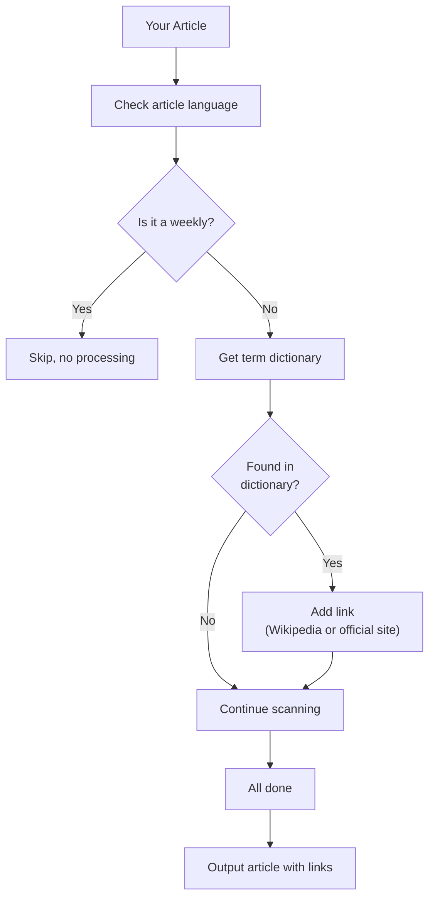

> **AI Disclosure:** The frontend visual design and written content in this article are original by the author. For the code, the author provided requirements, creative direction, and domain definitions for the terminology glossary, while [OpenCode](https://sspai.com/post/opencode.ai) handled the specific implementation. The author reviewed, manually adjusted, and then deployed the final version.


# Why Add Links to Terms

A friend recently read one of my articles about self-hosting servers and NAS, and sent me this feedback:

> RSS, WebDAV, DDNS, NAT traversal… so many abbreviations and terms keep appearing. I had to scroll back up to remember what each one meant. Looking each one up on my phone completely breaks my reading flow.

This was a great question worth solving. On one hand, this friend was already a dedicated reader — willing to read the whole thing and take the time to tell me what felt off. On the other hand, I realized an uncomfortable truth: **many of my articles assume readers already know the basics, but everyone comes to these concepts from a completely different path.** In my view, how readers discover concepts matters more than whether they know them at all. If their understanding of a concept is off, it leads to misreading even more information downstream — making things worse over time. That reading experience might be even more frustrating than simply not understanding.

So-called "reading experience" isn't always about typography or spacing. **At its core, reading experience is about whether readers can focus on what you're saying, instead of being forced to switch context every few seconds to look up a strange term.** Each second of switching and searching chips away at the reader's patience.

Here's the final result👇.

<video src="/posts/_images/video_2026-06-28_20-40-23.mp4" controls playsinline></video>

Modern mobile browsers also support long-press link preview, so you don't necessarily need to navigate away. You can quickly understand a concept and continue reading — I think that's an even better experience.

<video src="/posts/_images/video_2026-06-28_20-40-17.mp4" controls playsinline></video>

> [!NOTE]
> If you're reading this on the live site, you may have already noticed that many unfamiliar terms are now clickable.

# Limitations of Existing Tools: Readers Must Actively Search

To be honest, there are already many solutions to this problem. Safari's inline lookup, Chrome's "Search for XXX", and even AI-powered browsers that translate jargon into plain language — these are all quite powerful.

The issue is: **they require the reader to take action, with too many steps.** The reader sees "DDNS", stops, selects it, waits for the search result — even if it takes just two seconds, when there are three or five unfamiliar terms in an article, the immersion is completely shattered.

The solution is simple: when readers encounter a key concept, clicking the word should take them to a site that explains it.

But here's the problem: a long article might involve a dozen or more terms. Every time I edit, I'd need to check whether each link is correct and present. Worse, a term might appear multiple times — I only want to link the first occurrence and keep the rest as plain text. If everything is a link, nothing is a link. Doing this by hand is basically fighting against myself.

So the question became: **I need a robot that "writes the article, hits publish, and generates links automatically."**

# Build-time Auto-embedding

My blog is built with Astro. Before each article is published, the entire site goes through a rebuild — all articles are compiled from `.md` files into static HTML pages. This is the perfect moment to inject term links.

Why not do this in the browser?

The runtime approach means every page load would download a term dictionary and run string matching on your device — an extra burden on performance and bandwidth. And if the matching logic changes, you wouldn't see the latest improvements immediately.

Handling this during the build is much cleaner: **the term links are embedded while the article is being compiled into HTML. Readers get a fully processed, ready-to-read static page.** In short, leave all the computation to the cloud.

Once I settled on this direction, the remaining questions were: how to match, what to skip, and how to integrate cleanly with Astro's Markdown processing pipeline.

# How It Works (Explained Simply)

Imagine you're reading a book (the articles on your site) with a stack of labels (a dictionary I prepared in advance).

Each label has a term and where to find its explanation — for example, the "RSS" label tells you to tap it to go to Wikipedia.

Now, instead of applying each label yourself, **a robot quickly scans every page of the book before it goes to print. It finds the terms, sticks the first label where the term first appears, and moves on.** It's smart enough to know not to stick labels in headings, code blocks, or places that already have one.

When all the labels are applied, the book gets printed and published. When you receive it, every unfamiliar term already has a clickable tag next to it.

Almost all concept sources use Wikipedia — it's the most comprehensive, stable, and language-friendly public knowledge base. More details below.

Here's the full flow chart👇:



That's the whole process. If you're not interested in the technical details, you can stop reading here.

## Implementation Anatomy: A Relay Race Between Two Plugins

On the code level, this mechanism is handled by two plugins, each running at a different stage of Astro's Markdown processing pipeline.

### Stage 1: remark-glossary

`remark-glossary` is a remark plugin (running during the Markdown AST processing stage). Its job is extremely simple: **read the `lang` field from the article's frontmatter and store it in `vfile.data.glossaryLang`.**

When an article doesn't declare `lang`, it defaults to Chinese (`zh`). This field is used later by the second plugin — Chinese articles use `zh.wikipedia.org`, English articles use `en.wikipedia.org`, and Traditional Chinese also uses `zh.wikipedia.org`.

Why a separate plugin for this? Because in Astro's Markdown pipeline, the remark stage runs first, and by then the frontmatter has already been parsed. While it's possible to access frontmatter in the later rehype stage, having one plugin do one thing is a clean engineering habit.

### Stage 2: rehype-glossary

`rehype-glossary` is the core engine, running during the rehype stage (when Markdown has already been converted to an HTML AST). It does the following:

1. **Reads the language** — gets the current article's language from `vfile.data.glossaryLang`
2. **Checks tags** — if the article's tags include "周刊" or "Weekly", skip the entire article (weekly content is time-sensitive and often uses terms casually, making links inappropriate)
3. **Traverses all text nodes** — uses `unist-util-visit` to walk the HTML AST and find every text node
4. **Matches terms** — uses the `findTermMatches` function to scan text for all glossary hits
5. **Replaces nodes** — splits text nodes into a sequence of "text fragments + `<a>` link fragments" and replaces the original node

```shell
Original text node:
"I use RSS and Git every day, and Docker to deploy services"

After matching and splitting:
"I use "
<a href="https://en.wikipedia.org/wiki/RSS">RSS</a>
" and "
<a href="https://en.wikipedia.org/wiki/Git">Git</a>
" every day, and "
<a href="https://en.wikipedia.org/wiki/Docker_(software)">Docker</a>
" to deploy services"
```

## Matching Rules: Longest Match First, Once Per Article

Term matching sounds simple, but there are many details to refine in practice.

### Longest Match First

If the glossary contains both "AppleScript" and "Script", you want "AppleScript" to match when it appears in text, rather than being intercepted by "Script". The approach is: sort all candidates by length in descending order, matching longer ones first. Once matched, mark it as used so it won't participate in subsequent node scanning.

### Once Per Article

The same term often appears multiple times in an article — "Docker" might appear at the beginning, middle, and end. Adding links every time would be visually noisy and pointless. **The same term ID is only linked on its first occurrence in the entire article.** This is tracked with a `usedIds: Set<string>` that is shared globally across all text node traversals.

### Which Nodes Are Skipped

Not all text is suitable for term linking. I maintain a skip list:

- `<code>` and `<pre>` — code blocks contain code, not natural language
- `<a>` — text already wrapped in a link cannot be nested inside another link (HTML doesn't allow nested `<a>` tags)
- `<h1>` through `<h6>` — headings have limited text, adding links feels redundant
- `<script>` and `<style>` — non-visible content
- `<input>`, `<button>`, `<select>`, `<textarea>` — form control text

### ASCII Term Boundary Check

For purely English terms (like `RSS`, `Git`, `AI`), I also need word boundary checks — ensuring `RSS` matches the standalone `RSS`, not a substring inside `RSSFeed`. The approach is to check whether the character before and after the match position belongs to `[\w]` (letters, digits, underscore). If it's adjacent to another word character, the match is skipped.

### Overlapping Match Handling

Multiple terms may overlap in the same text segment. For example, if the glossary has both "GitHub" and "Git", and the text is "GitHub Pages", the correct behavior is to match "GitHub" rather than "Git". My approach is to sort all candidate matches by start position, then take non-overlapping matches from front to back — only including results whose start position is greater than or equal to the previous match's end position.

### URL Decision Tree

Once a term is matched, where does the link point? I designed a priority chain:

```shell
1. langs[lang].url       — custom URL for that language (e.g., official Chinese docs)
2. entry.url             — top-level custom URL (e.g., product home page)
3. Auto-generated Wikipedia URL — language-based subdomain + wikiPath
```

Why custom URLs? Some terms don't have a corresponding Wikipedia page (e.g., niche open-source tools), or the Wikipedia page is too sparse. Pointing to the official website or documentation is often better. Currently about 15% of terms have custom URLs configured for this purpose.

The Wikipedia URL generation rules are straightforward:

| Language | Generated URL                              |
| -------- | ------------------------------------------ |
| `zh`     | `https://zh.wikipedia.org/wiki/{wikiPath}` |
| `zh-tw`  | `https://zh.wikipedia.org/wiki/{wikiPath}` |
| `en`     | `https://en.wikipedia.org/wiki/{wikiPath}` |

Simplified and Traditional Chinese share Chinese Wikipedia, though the URL-encoded path may differ depending on the term's character variant.

**Why mostly Wikipedia?** Because Wikipedia has these advantages:

- **Broad coverage** — most technical terms have dedicated entries, no manual maintenance needed;
- **Multi-language support** — automatically matches the article's language to the corresponding subdomain, so Chinese, English, and Traditional Chinese readers all see explanations in their native language;
- **Stable links** — Wikipedia URLs are protected by redirects and rarely break.

For the minority of terms without suitable Wikipedia pages (about 15%), I manually specify the official site or more authoritative documentation via custom URLs. This ensures automation for most cases while retaining flexibility for special cases.

## Supporting Tools: Audit Script and Glossary Overview Page

Maintaining a glossary requires tools to help discover "what should be added but hasn't been yet."

### audit-glossary.ts

This script scans all article content, using regex to find high-frequency English capital-letter phrases, abbreviations, mixed-case product names, etc. It then compares them against the existing glossary and outputs a report of "unregistered high-frequency terms."

For example, it might report: "DALL-E appears 6 times, Tailwind appears 3 times — neither is in the glossary yet." This lets me quickly decide whether to add them.

Of course, the heuristic isn't perfect — many common English words get flagged too (like `What`, `This`) — but as a tool for discovering omissions, it's effective enough.

### /glossary Overview Page

The site also has a `/glossary/` page (with `/en/glossary/` and `/zh-tw/glossary/` variants), which groups all registered terms alphabetically with short descriptions. Readers can visit [this page](https://cgartlab.com/glossary/) to browse the full encyclopedia link index.

This page serves as a great "site content map" — you can tell at a glance which domains this blog focuses on.

### Results and Limitations

Currently the glossary contains over 60 terms covering five categories: technical foundations (RSS, XML, Git, Docker, DNS, SSH), AI/LLM (AI, Gemini, ChatGPT, Claude, Ollama, Cursor), self-hosted tools (WordPress, Telegram, Obsidian, Syncthing), knowledge management (Notion, Obsidian, Evernote), and art/design (Impressionism, C4D).

The effect was immediate after deployment: **I no longer have to think "the reader might not understand this, should I add a link?" while writing. That burden is completely gone.** I just write normally, and the build process handles term link embedding automatically. When my friend revisited the site, clicking unfamiliar terms jumped directly to explanations, barely interrupting reading flow.

Of course, there are limitations:

- **The glossary needs ongoing maintenance** — new terms from new domains need manual addition. This is currently the biggest maintenance cost. The audit script helps discover omissions, but adding still relies on human judgment.
- **Polysemous terms can't be handled automatically** — "Node" means completely different things in programming and networking contexts, but the system can only link to one target. For such terms, I still have to manually add links based on context.
- **Synonym inference isn't supported** — "GitHub" and "GH" are currently separate entries and won't be automatically associated. If GH appears frequently in the future, I'll add it manually as a synonym.

## Summary and Future Plans

While building this feature, I kept asking: **who is the audience for a technical blog?**

If you're writing for peers, you might not need any links at all — RSS needs no explanation. But if you're writing for newcomers, cross-domain readers, or someone who stumbled upon your site by accident, every unexplained term can become an invisible wall.

Opening a window in that wall and putting up a button saying "tap here for details" is the lowest-cost, most sincere approach I can think of right now.

The glossary will certainly expand to cover more domains in the future. I'm also considering adding automatic keyword extraction to generate term link candidates. But that's a story for another day.

---

# Reference Links

- [rehype-glossary Plugin Source](https://github.com/cgartlab/cgartlab.github.io/blob/main/src/plugins/rehype-glossary.ts) — core matching logic
- [remark-glossary Plugin Source](https://github.com/cgartlab/cgartlab.github.io/blob/main/src/plugins/remark-glossary.ts) — language extraction
- [Glossary Data](https://github.com/cgartlab/cgartlab.github.io/blob/main/src/data/glossary.ts) — 60+ term definitions
- [Glossary Utilities](https://github.com/cgartlab/cgartlab.github.io/blob/main/src/utils/glossary.ts) — URL resolution and alias generation
- [Audit Script](https://github.com/cgartlab/cgartlab.github.io/blob/main/scripts/audit-glossary.ts) — unregistered term discovery tool
- [unist-util-visit](https://github.com/syntax-tree/unist-util-visit) — AST traversal utility library
- [Astro Plugin Docs](https://docs.astro.build/en/guides/markdown-content/) — custom rehype/remark plugin integration guide
