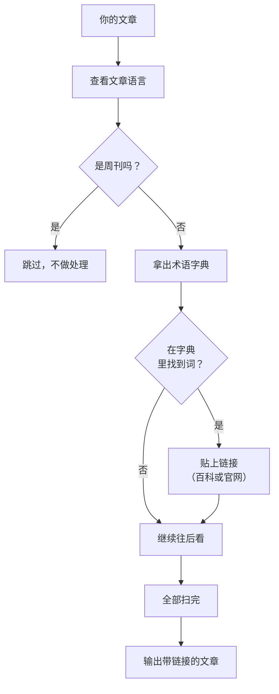

# 为什么要给术语加链接

上周有位朋友在看完站内某篇涉及自建服务器和 NAS 的文章之后发来一条反馈：

> RSS、WebDAV、DDNS、内网穿透……一堆缩写和名词来回出现，看到后面得往上翻去回忆哪个是哪个。挨个用手机划词搜索又太打断阅读节奏。

这真是个好问题，值得解决。一方面，这位朋友其实已经算是深度读者了——愿意把整篇看完，还愿意花时间告诉我哪里不舒服。另一方面，我意识到一个很尴尬的事实：**我的很多文章默认读者已经了解很多基础概念，但实际上每个人接触这些概念的路径完全不同。** 在我看来，读者了解概念的渠道要比知不知道这个概念更重要，对概念的认知本身出现偏差，会直接导致误读更多信息，以后只会更尴尬，这样的阅读体验或许比看不懂更加糟糕。

所谓「阅读体验」，有时候并不是排版好不好看、字间距舒不舒服这么表面的事情。**阅读体验的核心，是读者能不能顺畅地把注意力集中在你想表达的内容上，而不是被迫反复切换到另一个上下文去查一个陌生名词。** 每一秒的切换和搜索，都是在消耗读者的耐心。

最终实现效果👇。


另外，现在的手机浏览器通常也都附带按住链接可以预览的功能，这样也就并不需要完全跳转页面，快速了解一下概念后继续浏览当前页面，我觉得这个体验更好一些。


> [!NOTE]
> 如果你是从官网访问的这篇文章，细心的你应该已经发现很多看不懂的词都可以点了。

# 现有工具的局限：读者需要主动搜索

其实这个问题已经有了太多解决方案。无论是 Safari 的划词查询，还是 Chrome 的「搜索 XXX」，甚至现在 AI 浏览器直接翻译成「人话」，都已经相当强大。

但问题在于：**它们需要读者主动发起动作，且步骤太多。** 读者读到「DDNS」这个词，停下来，选中它，再等搜索出结果——这个过程哪怕只要两秒，累积在一篇有三五个陌生术语的文章里，阅读的沉浸感也已经被彻底打碎。

解法很简单，碰到一个关键概念，点一下这个词就能跳转到介绍这个概念的网站就行了。

那么问题来了，一篇长文可能涉及十几二十个术语，每次修改还要检查链接对不对、挂了没有。更麻烦的是，一个术语在文章里可能出现了好几次，我只想在第一次出现时挂链接，后面出现时保持朴素文本，不然整篇文章全是重点，也就没有重点了吧——但纯手工做这件事，基本是在跟自己过不去。

于是问题变成了，**我需要一个帮我「写完文章、按下发布，链接自动生成」的智能机器人。**

# 构建自动嵌入链接

我的博客基于 Astro 构建，每篇文章发布之前，整个网站都会经过一次重新计算生成页面——所有的文章默认从 `.md` 文件变成静态 HTML 网页。这个过程恰好是给术语嵌入链接的最佳时机。

为什么不选择在浏览器端做这件事？

运行时方案意味着你每次页面加载时都要下载一个术语表、在你的设备跑一遍字符串匹配，对设备性能和网络带宽都是额外的负担。而且如果匹配逻辑有更新，你无法在第一时间看到最新的改进变化。

如果在构建的时候直接处理好这个过程，就干净得多：**文章在编译成 HTML 的同时，术语链接就已经被嵌入进去。读者拿到的是一份已经处理好的、可以直接阅读的静态页面。** 总之，把所有的计算负担交给云端去处理就好。

确定了这个方向之后，剩下的问题就是：概念怎么匹配、关键词怎么跳过、怎么优雅地和 Astro 的 Markdown 文档处理管线协作。

# 用人话讲原理

想象你正在看一本书（就是你们网站上的那些文章），和一堆标签（我提前准备的一本字典）。

每一张标签都写着一个名词和它的解释在哪里可以找到——比如「RSS」标签告诉你，戳它就能去维基百科看答案。

现在，不用你亲自一张一张去贴。**有一个机器人，在书的每一页被印刷之前，先快速扫一遍全文，找到标签的名词，把第一张标签贴到这个词第一次出现的位置，然后换个地方继续找。** 它还很聪明，知道标题里、代码框里、已经贴过的位置不能贴。

全部贴完之后，书就印刷出版了。你拿到手的时候，看到不懂的词身上已经有一个可以点的小标签了。

几乎所有的概念来源我都用了维基百科，它是目前最全、最稳定、支持语言最多的公共知识库，下文也会进行详细说明。

附上整个运行机制的流程图如下👇：



这就是全部过程，如果你对具体的技术细节毫无兴趣，看到这里就够了。

## 实现解剖：两个插件的接力赛

从专业角度看，说回代码层面，这套机制由两个插件完成，分别跑在 Astro Markdown 处理管线的不同阶段。

### 第一阶段：remark-glossary

`remark-glossary` 是一个 remark 插件（处理 Markdown AST 的阶段），它的任务极其简单：**读取文章 `frontmatter` 里的 `lang` 字段，把它存到 `vfile.data.glossaryLang` 中。**

文章没有声明 `lang` 时默认中文（`zh`）。这个字段在后面会被第二个插件用到——中文文章用 `zh.wikipedia.org`，英文文章用 `en.wikipedia.org`，繁体中文保持 `zh.wikipedia.org`。

为什么需要单独一个插件来做这件事？因为 Astro 的 Markdown 管线里，remark 阶段最先执行，此时 `frontmatter` 已经被解析好了。如果等到后面的 rehype 阶段再去拿 `frontmatter`，虽然也能拿到，但让一个插件只做一件事，是清晰的工程习惯。

### 第二阶段：rehype-glossary

`rehype-glossary` 是核心引擎，运行在 rehype 阶段（此时 Markdown 已经被转为 HTML AST）。它做以下事情：

1. **读取语言**——从 `vfile.data.glossaryLang` 拿到当前文章的语言
2. **检查标签**——如果文章 `tags` 包含「周刊」或「Weekly」，直接跳过整篇文章（周刊属于时效性内容，不适合做术语链接，而且周刊里经常拿术语开玩笑，链接过去反而不合适）
3. **遍历所有文本节点**——用 `unist-util-visit` 走一遍 HTML AST，找到每一个文本节点
4. **匹配术语**——用 `findTermMatches` 函数扫描文本，找出所有命中术语表的位置
5. **替换节点**——把文本节点拆成「文本片段 + `<a>` 链接片段」的混合序列，替换到原来的位置

```shell
原始文本节点：
"我每天都在使用 RSS 和 Git，还会用 Docker 部署服务"

匹配后拆分为：
"我每天都在使用 "
<a href="https://zh.wikipedia.org/wiki/RSS">RSS</a>
" 和 "
<a href="https://zh.wikipedia.org/wiki/Git">Git</a>
"，还会用 "
<a href="https://zh.wikipedia.org/wiki/Docker">Docker</a>
" 部署服务"
```

## 匹配规则：长词优先，一词一次

术语匹配看着简单，实际落地时有很多细节需要打磨。

### 长词优先

如果一个术语同时匹配了「AppleScript」和「Script」，你肯定希望在文本中出现 `AppleScript` 时链接到 AppleScript，而不是被 `Script` 截胡。做法是：把所有候选词按长度降序排列，长的先匹配。匹配完后标记已用，不再参与后续节点的扫描。

### 每篇文章只链接一次

同一个术语在一篇文章里经常出现多次——比如「Docker」可能在文章开头、中间、末尾都出现过。如果每次出现都加上链接，视觉上会非常杂乱，而且没有任何意义。**同一个术语 ID 在全文中只链接第一次出现的位置。** 这个逻辑用一个 `usedIds: Set<string>` 来追踪，遍历文本节点时全局共享。

### 跳过哪些节点

不是所有文本都适合做术语链接。我维护了一份跳过清单：

- `<code>` 和 `<pre>`——代码块里的名词是代码的一部分，不是自然语言
- `<a>`——已经包裹在链接里的文本，不能再套一层链接（HTML 不允许嵌套 `<a>`）
- `<h1>` 到 `<h6>`——标题区域文字有限，加链接显得冗余
- `<script>`、`<style>`——非可见内容
- `<input>`、`<button>`、`<select>`、`<textarea>`——表单控件里的文本

### ASCII 术语的边界检查

对于全英文的术语（比如 `RSS`、`Git`、`AI`），还需要做单词边界检查——确保 `RSS` 匹配的是独立的 `RSS`，而不是夹杂在 `RSSFeed` 这个字符串里。做法是检查匹配位置前后一个字符是否属于 `[\w]`（字母、数字、下划线），如果前后紧挨着其他单词字符，则跳过这次匹配。

### 重叠匹配的处理

多个术语可能在同一段文本中出现位置重叠。比如术语表中同时有「GitHub」和「Git」，如果文本是「GitHub Pages」，正确的行为应该是匹配「GitHub」而不是「Git」。我的做法是将所有候选匹配按起始位置排序，然后从前到后取不重叠的匹配——起始位置大于等于上一个匹配的结束位置时才纳入结果。

### URL 决策树

匹配到术语之后，链接指向哪里？我设计了一个优先级递减的决策链：

```shell
1. langs[lang].url       — 该语言下自定义 URL（如指向官方中文文档）
2. entry.url             — 顶层自定义 URL（如产品官网）
3. 自动拼接 Wikipedia URL — 按语言选择子域名 + wikiPath
```

为什么需要自定义 URL？有些术语没有对应的 Wikipedia 页面（比如一些小众开源工具），或者 Wikipedia 页面内容过于简略，指向官方网站或文档是更好的选择。目前大约有 15% 的术语配置了自定义 URL，专门处理这类情况。

Wikipedia URL 的拼接规则也很直接：

| 语言 | 生成的 URL |
|------|-----------|
| `zh` | `https://zh.wikipedia.org/wiki/{wikiPath}` |
| `zh-tw` | `https://zh.wikipedia.org/wiki/{wikiPath}` |
| `en` | `https://en.wikipedia.org/wiki/{wikiPath}` |

繁体中文和简体中文共用中文维基百科，只是 URL 编码后的路径可能不同（取决于词条本身的繁简体设置）。

**为什么大部分链接指向维基百科？** 因为维基百科具有以下优势：

- **覆盖面广**——绝大多数技术术语都有独立词条，无需手动维护；
- **多语言支持**——根据文章语言自动匹配对应子域名，中文/英文/繁中读者都能看到母语解释；
- **链接稳定**——维基词条 URL 受重定向保护，不会轻易失效。

对于少数没有对应维基页面或维基词条过于简略的术语（约占 15%），我会通过自定义 URL 手动指定官网或更权威的文档。这样既保证了绝大多数场景的自动化，也保留了特殊情况的灵活处理空间。

## 辅助工具：审计脚本与术语总览页

除此之外，要维护一套术语表，需要工具来辅助发现「有哪些应该收录但还没收录的术语」。

### audit-glossary.ts

这个脚本会扫遍所有文章正文，用正则找出高频出现的英文大写词组、缩写、混合大小写的产品名等候选词，然后对照现有术语表，输出一份「未注册高频术语」报告。

比如跑完后可能告诉你：「DALL-E 出现了 6 次、Tailwind 出现了 3 次，都还没收录。」这样我就能快速判断是否要把它们加进术语表。

当然这套启发式规则并不完美——很多普通英文单词也会被当成候选（比如 `What`、`This`），但作为发现遗漏的辅助工具，它已经足够有效。

### /glossary 术语总览页

站点上还有一个 `/glossary/` 页面（支持 `/en/glossary/` 和 `/zh-tw/glossary/`），它会按字母分组展示所有已收录的术语及其简短描述。读者可以直接访问 [这个页面](https://cgartlab.com/glossary/) 来浏览完整的百科链接索引。

这个页面本身也是一个很好的「站点内容地图」——从术语分布就能看出来这个博客主要聚焦在哪些领域。

### 效果与局限

目前术语表收录了 60 多条术语，覆盖技术基础（RSS、XML、Git、Docker、DNS、SSH）、AI/大模型（AI、Gemini、ChatGPT、Claude、Ollama、Cursor）、自托管工具（WordPress、Telegram、Obsidian、Syncthing）、知识管理（Notion、Obsidian、Evernote）、艺术设计（印象派、C4D）等五个类别。

实际效果在部署后立竿见影：**以前写文章时需要在心里默念「这个地方读者可能看不懂，我要不要加个链接」，现在这个负担完全消失了。** 我只需要正常写，构建流程自动帮我完成术语链接的嵌入。朋友再次浏览时，看到不懂的词直接点击跳转，阅读节奏几乎没有被打断。

当然也有局限：

- **术语表需要持续维护**——比如一个新领域的新名词需要手动添加，这是目前最大的维护成本。审计脚本虽然能辅助发现遗漏，但添加与否仍然靠人工判断。
- **多义词无法自动处理**——比如「Node」在编程语境和网络语境下含义完全不同，但目前只会匹配唯一的目标链接。对这种词目前还只能凭借实际的上下文来手动嵌入链接。
- **不支持同义词推断**——比如「GitHub」和「GH」目前是两个独立条目，不会自动关联。如果后续发现 GH 在文章里高频出现，我会手动添加为同义词。

## 总结和规划

做这个功能的过程中，我还一直在想一个问题：**技术博客的读者是谁？**

如果是写给同行的，可能根本不需要链接，RSS 是什么不需要解释。但如果是写给想入门的、跨领域的、或者只是偶然点进来的读者，每一处没有解释的名词都可能成为一堵隐形的墙。

在墙上开一扇窗，贴上一个按钮说「戳这里可知其详」。这是我目前能想到的、成本最低又诚意满满的做法。

未来这个术语表一定会覆盖更多领域，同时考虑加入自动提取文章关键词后生成术语链接候选的机制。但那是另一个故事了。

---

# 参考链接列表

- [rehype-glossary 插件源码](https://github.com/cgartlab/cgartlab.github.io/blob/main/src/plugins/rehype-glossary.ts) — 核心匹配逻辑
- [remark-glossary 插件源码](https://github.com/cgartlab/cgartlab.github.io/blob/main/src/plugins/remark-glossary.ts) — 语言提取
- [术语表数据](https://github.com/cgartlab/cgartlab.github.io/blob/main/src/data/glossary.ts) — 60+ 术语定义
- [glossary 工具函数](https://github.com/cgartlab/cgartlab.github.io/blob/main/src/utils/glossary.ts) — URL 解析与别名生成
- [审计脚本](https://github.com/cgartlab/cgartlab.github.io/blob/main/scripts/audit-glossary.ts) — 未注册术语发现工具
- [unist-util-visit](https://github.com/syntax-tree/unist-util-visit) — AST 遍历工具库
- [Astro 插件文档](https://docs.astro.build/en/guides/markdown-content/) — 自定义 rehype/remark 插件集成方式
