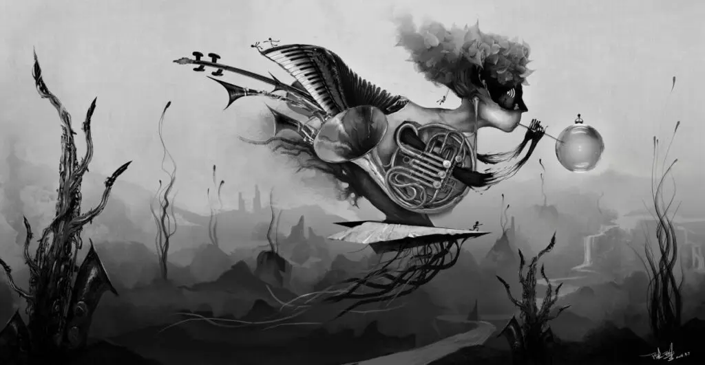

每次做点不同风格的东西，都要按别人的要求，或自己的构想，去找很多参考。

这些参考大多都是图像，有现代的，有古代的，唯一的相同之处是它们来自非常原始的某种理念，代表的是特定时代下一小撮儿人对世界和自己的解读。

今天早已是个图像（视频也是运动的图像）时代，同时遮蔽人去思考的尤其是只言片语的概念。在屏幕上读到只言片语，就可以那么轻松的去和自己的生活做对应。或许是信息获取的方式和渠道太方便了，造成人观看信息的行为非常轻率。

知道的越多，不等于做的决策和行为，以及产生的结果，越有穿透力。

我们今天了解一个作品的内容，都会提前先给它找好一个抽屉，这个抽屉上贴着丰富的标签，写着这事儿谁做的，什么时候做的，在哪里做的，用了什么方法来做。这些被称为知识背景。

在这样必须具有哪怕只有一点点知识背景的前提下，人才会继续从感觉层面理解那个内容。如果直接去感觉，人通常是不会放心自己的感觉的。

比如，你会因为一个电影或游戏，开始爱听原来并不感兴趣的音乐。

接受信息的时候，知识背景当然还是要有的，但最终还是会回到纯粹的感觉层面。难处理的地方是，如何把这两种状态切换自如。

比方说听音乐，音乐本身有类型，流派，年代，作曲家…这些都是知识背景，当你认为自己被一首音乐旋律或歌词打动的时候，自然会顺着这些知识背景标签去寻找相似的音乐。软件的推荐算法也会把这个作为参考，去猜你下一首想听什么。

可是，除了歌词和旋律（其实我认为旋律包含了歌词，小时候不懂英语，不影响我喜欢林肯公园），我觉得还有一样打动人的东西就是乐器本身的声音质地，这是纯粹的感觉层面，我相信伟大的作品最终也会让人恢复到纯粹感觉层面，纯粹到你无法描述，最多分享给朋友让他也试试看，在纯粹的感觉里，会完全忘记自己以前知道的那些东西。因为这个感觉太新了，新到突破你的认知，新到你看不懂却大受震撼。

这种感受也很难说到底是作品给你带来的，还是你自己带来的。能确定的是它们同时在这个时空里生成，变化，湮灭。我确信，如果作品带来的感受是一，我自己产生的部分也是一，在当时，一加一肯定大于二。

还多出来的那些是什么，至今我不知道。
