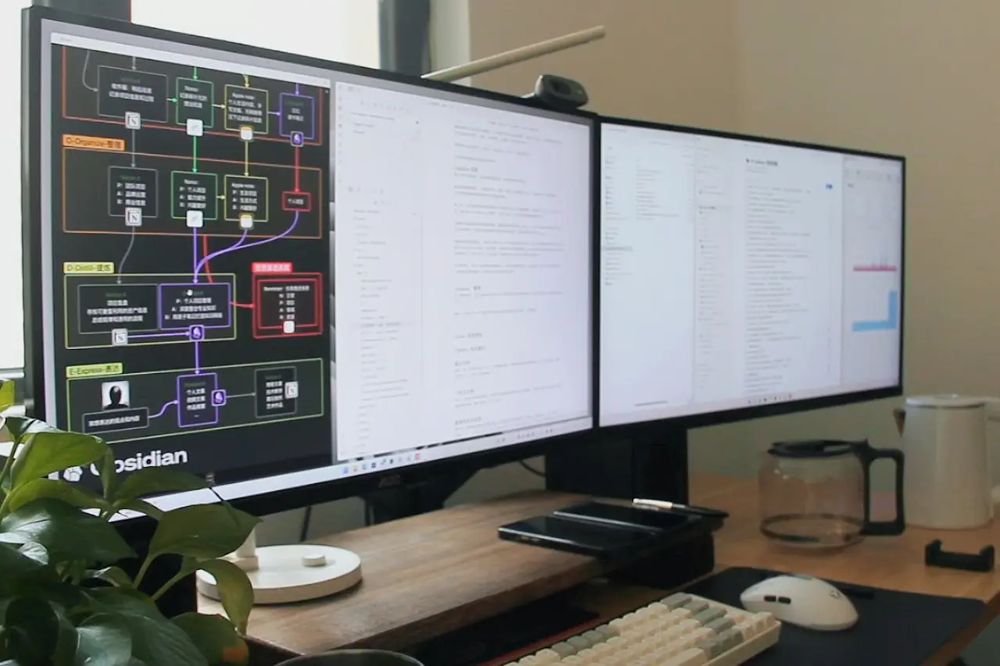

# Preface

In the digital age, managing personal information and ideas has become increasingly important. Building a personalized digital second brain is key to improving productivity and creativity. I'll walk you through the journey from concept to practice — how to design and establish your own second brain.

Enough talk — let me show you the results first.

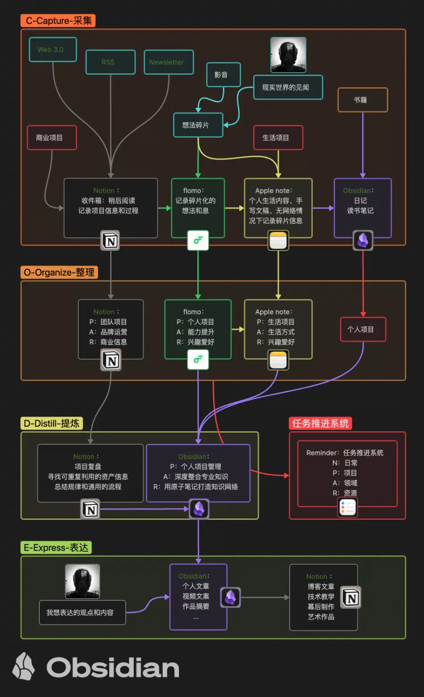

Previous article: [Building the Second Brain](https://cgartlab.com/en/posts/build-the-second-brain/)

As a freelance designer, the accumulated mass of long-term project materials, creative assets, and learning notes has made me acutely aware of the immense information management challenges designers face in the digital age.

I've always believed that professional growth often comes from outside one's profession. And as designers in different fields, each of us has a unique workflow and aesthetic orientation. If you're also a designer, I hope my experience and lessons will be useful to you. If you work in another field, I think you'll find inspiration here too — whether it's choosing the right elegant tools or finding a new path for designing your own workflow.

# The Evolution of an Idea

Since I first wrote about the second brain last year, my understanding of the concept has gone through three stages (or perspectives): **tool, system, and mindset.** Now I realize it's not just a tool, but a systematic approach that ultimately evolves into a way of thinking — constantly interacting with our first brain in a kind of dreamlike synchrony.

## Tool

At first, I only used Evernote — a classic case of advanced "hoarding syndrome." I shoved everything into it without any categorization. It was basically a copy-paste operation, filled with the illusory satisfaction of "collecting equals learning." Looking back, the only useful feature Evernote had for me was multi-platform sync. But the stingy monthly sync traffic limit and the bloated, sluggish client gradually killed my interest.

Then, lured by unlimited sync traffic, I jumped to Microsoft OneNote — only to find the mobile experience was terrible, and the PC UI quickly wore out its welcome. Bailed.

Next, I followed the crowd and switched to Notion, drawn by its free unlimited storage, elegant interface, and flexible yet sensible layout. When I tried to import everything from Evernote into Notion, I ironically discovered just how trivial my mindlessly copied content was. Most of it was just artwork images from Weibo art accounts introducing various artists.

A tool is just software — a digital platform for managing and organizing information. I focused on choosing the right tool, learning how to use it, and trying to organize my notes, documents, and ideas into a structured system. But as I used my second brain more deeply, I began to realize it was far more than that.

## System

In the second stage, I started seeing the second brain as a system — a systematic approach to processing and managing complex information. I was no longer limited to simply collecting and storing information. Instead, I thought about how to build a more complete, organic knowledge architecture. I redesigned my second brain structure, creating richer categories and tag systems to better reflect the relationships between different pieces of information.

During this phase, I tried many more tools and eventually settled on Notion, Obsidian, flomo, Apple Notes, and Apple Reminders. I gave up on the all-in-one obsession and let specialized tools handle specialized tasks.

## Mindset

Over time, the data in each tool has subtly shifted. I've gradually realized that the true value of the second brain lies not just in the information it contains or the network it grows, but in the way of thinking it represents.

That's when I entered the third stage — gradually refining the methodology based on patterns observed by those who came before, adapting it step by step to better suit my own workflow. At this stage, the second brain has become a thinking tool — a framework for organizing, diverging, connecting, and generating ideas. It's no longer just a digital note-taking system or knowledge management tool. It's tightly integrated with work and learning, used directly for problem-solving, planning, and discovering new creative directions.

# Design Approach

As a designer, designing a second brain is like taking an order from myself. The first step is naturally to clarify goals and needs.

## Define Goals and Needs

You need to define what you want your second brain to achieve — whether it's knowledge management, creative thinking, project planning, or even all-in-one.

After aggressively streamlining all my work and life workflows, the core process that remained was surprisingly simple: **read, edit, output.**

The only difference is the type of data being processed under different tasks. For example: recording ideas, mind mapping, routine meetings, writing — these involve text. Drawing and design involve models, images, and occasionally video and audio. The files I use on a daily basis really only come in a few types. Other project files and software tools are usually only touched when I'm recycling assets or learning new skills. I use a separate method for managing purely work-related items — but let's get back to knowledge management.

Based on my needs, the overall design framework for my second brain is **CODE**: **Capture, Organize, Distill, Express** (from Tiago Forte's _Building a Second Brain_). I also jotted down which tools I planned to use for each stage.

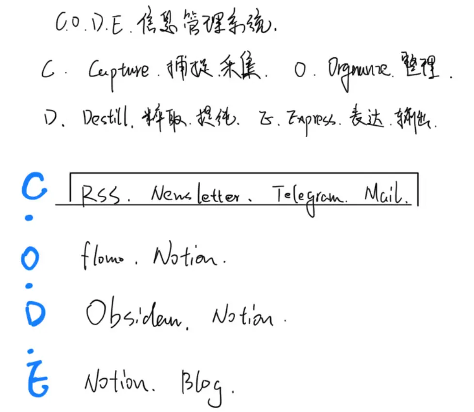

A drawing hand — my handwriting is not great, apologies.

That note was from last year, and it doesn't fully match my current setup. It was just a quick sketch, far from a mature idea.

## Choose the Right Tools

Choosing the right tools is crucial. Tools affect the efficiency, quality, and experience of the entire process. Before choosing, you need to understand each tool's design philosophy, features, applicable scenarios, and visual appeal (designer's occupational hazard).

The tools I currently use: Notion, Obsidian, flomo, Apple Notes.

I'll introduce them below according to the overall design framework.

## Capture

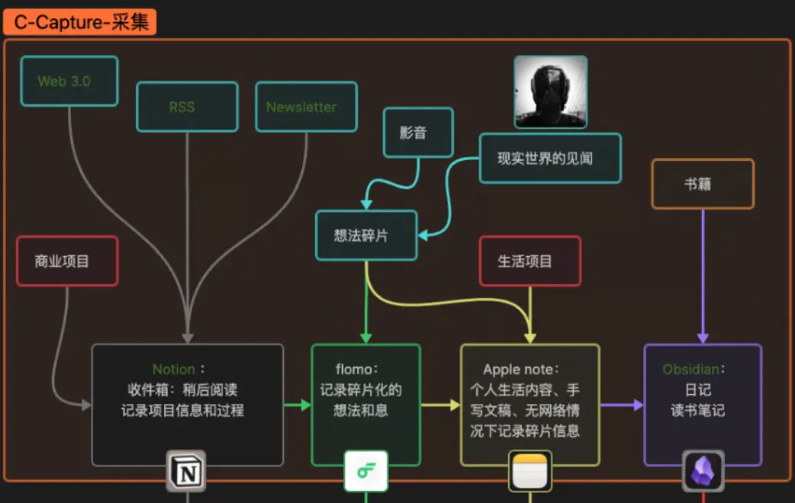

The first step is capturing information. This falls into two categories: what I see and what I think.

Valuable information I see usually comes from books, film/TV, the web, social media, RSS, newsletters, and news media.

This order roughly reflects the average quality of each information source.

Apart from books, I generally use Notion's web clipper for collecting information from other sources. It goes into Notion's Inbox page, managed as a single database without special categorization — I just track whether I've reviewed it or not. It basically serves as a "read it later" function. But its main purpose is managing work projects, which I won't go into here.

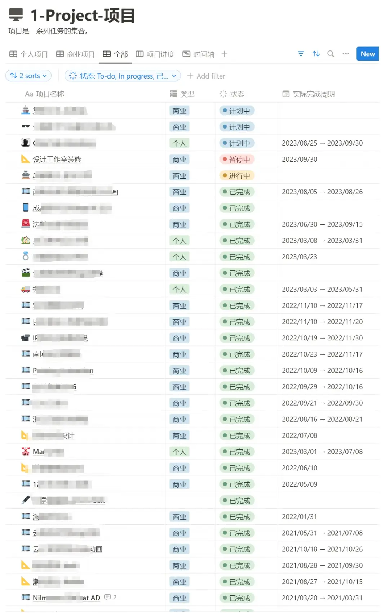

Books are the most valuable source of information, requiring dedicated time blocks. I don't have a strong preference between ebooks and physical books — each has its merits. I record both excerpts and my thoughts at the time of reading directly into Obsidian. Obsidian also serves as my daily journal, helping me feel like I'm making progress toward my goals.

Valuable information I think of mostly comes from the real world. I usually record it in flomo and Apple Notes. flomo's lightweight design and cross-platform sync are much better than Notion and Obsidian, and it works better in China's network environment. Apple Notes is more convenient for offline use (like on planes or trains) or when I want to jot down ideas with an Apple Pencil.

A side note: whenever information intake is discussed, algorithmic recommendations and filter bubbles inevitably come up. I'm not entirely opposed to algorithms — everything has two sides. Too much or too little of anything is probably not ideal.

## Organize

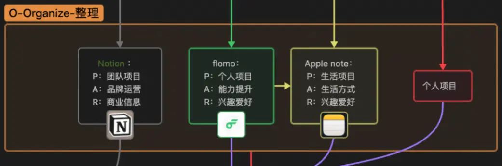

At the organization stage, I consider not only the content characteristics of work and personal knowledge management, but also how to optimize based on each tool's strengths.

I use the classic P.A.R.A. framework:

> **Project** — Short-term activities in work or life with clear goals and timeframes.
> **Area** — Long-term responsibilities where doing well benefits others and you're accountable. No specific goals, but each area has standards you uphold.
> **Resource** — Information with potential future value — topics of interest, research subjects, reference material, personal hobbies.
> **Archive** — Dormant items from the above three categories: completed or canceled projects, areas you're no longer involved in, marginalized resources.

After understanding P.A.R.A., I mapped each category to my designer workflow as shown below. For archiving, I use my own NAS with a custom management system that works better for me, so I won't cover it here.

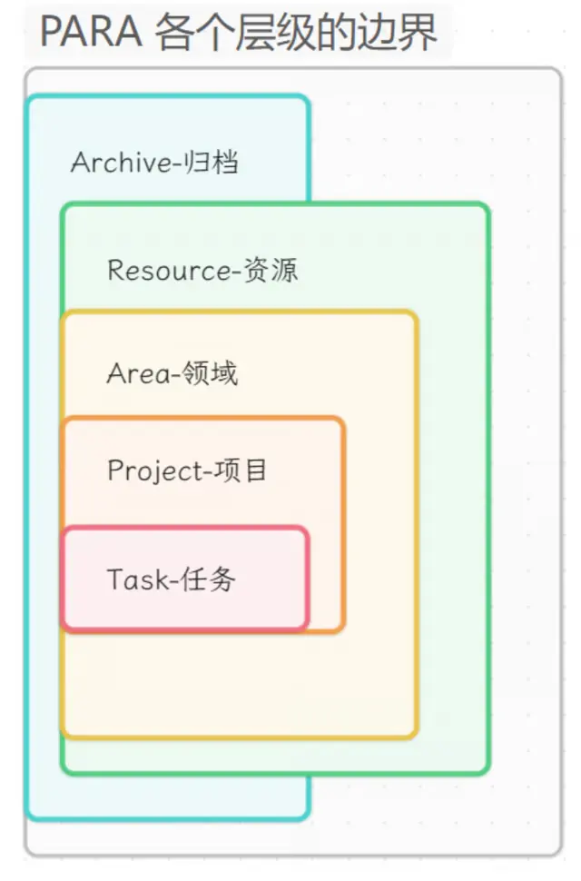

For example, Notion excels at real-time sync and collaboration. It's best suited for managing commercial projects and brand operations. flomo is mainly for recording fragmented thoughts and real-world information, making it more personal — categorized under personal projects, skill development, and hobbies. Apple Notes is more private and completely work-unrelated, so I use it for life projects and personal interests.

## Distill

Next comes the distillation phase. Notion handles project retrospectives, recycling project assets, and summarizing workflow patterns to reduce repetitive work and improve efficiency. Obsidian manages personal projects, deeply integrating professional knowledge structures, and building an increasingly complete knowledge network. The biggest benefit is that new knowledge integrates faster.

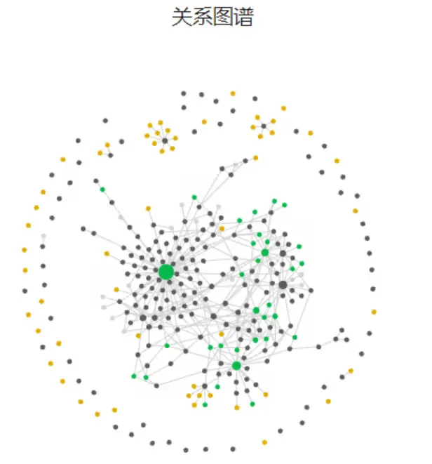

I also place my task management system here, using only Apple's built-in Reminders. It syncs across platforms and integrates with the Calendar app. After distilling information, any project can be broken down into individual actionable tasks.

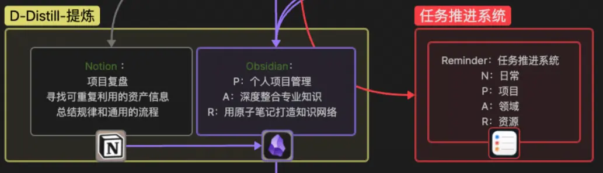

## Express

After the previous stages, organizing valuable discoveries and thoughts into accessible content is the essence of expression and output.

At this stage, my main outputs include articles, video scripts, and project descriptions. I use Obsidian for these because it emphasizes local data management, and pairing it with Git for sync and backup works perfectly.

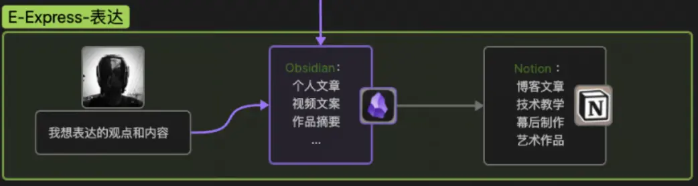

For blog posts, technical tutorials, behind-the-scenes content, and artwork that I want to publish publicly, I use Notion. These are primarily for sharing, and Notion's clean interface, flexible layout, and comfortable reading experience are ideal. But beyond appearance, the core structural design matters more.

# Building the Structure

Next, establishing the structure is key. This is essentially what I meant earlier about treating the second brain as a thinking tool. The structure designed with this tool helps me organize and manage content more effectively, with the flexibility to not be constrained by any single tool. I've always believed: **programs come and go, but data stays forever.**

Looking at the overall structure diagram, you can see that my design follows CODE vertically and P.A.R.A. horizontally.

CODE runs vertically, threading linearly through the entire second brain from input to output. P.A.R.A. runs horizontally, defining the classification approach within each tool for managing the smallest units of information. None of this depends on the tools themselves — even if I replaced Obsidian with Windows Notepad, Word, or VS Code, it would still work.

# Customizing Tools

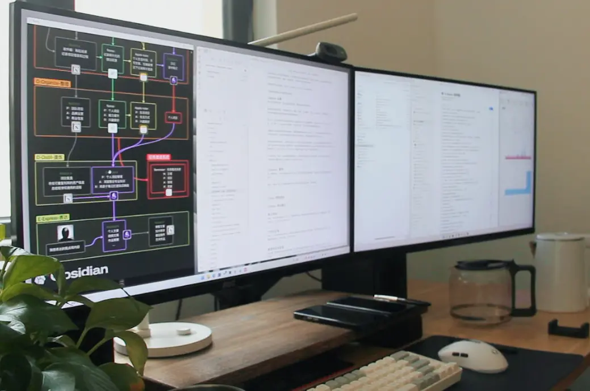

Personalization is essential. You can customize your tools based on your preferences and workflow. Here are a few examples for reference:

## Notion

In Notion, I use two custom databases to manage published articles and artworks, then use Super to build a personal website — not my main site, but more of a backup.

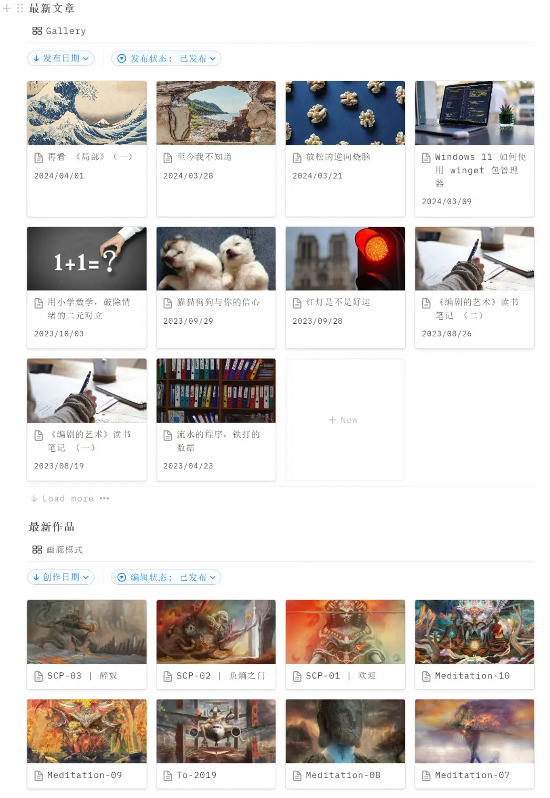

## Obsidian

Obsidian's customization comes through its rich plugin ecosystem. The most useful ones for me are Git, Calendar, Projects, and Weread. Git syncs my vault, Calendar handles daily notes, Projects manages personal projects that don't need sharing, and Weread syncs highlights from WeRead (微信读书).

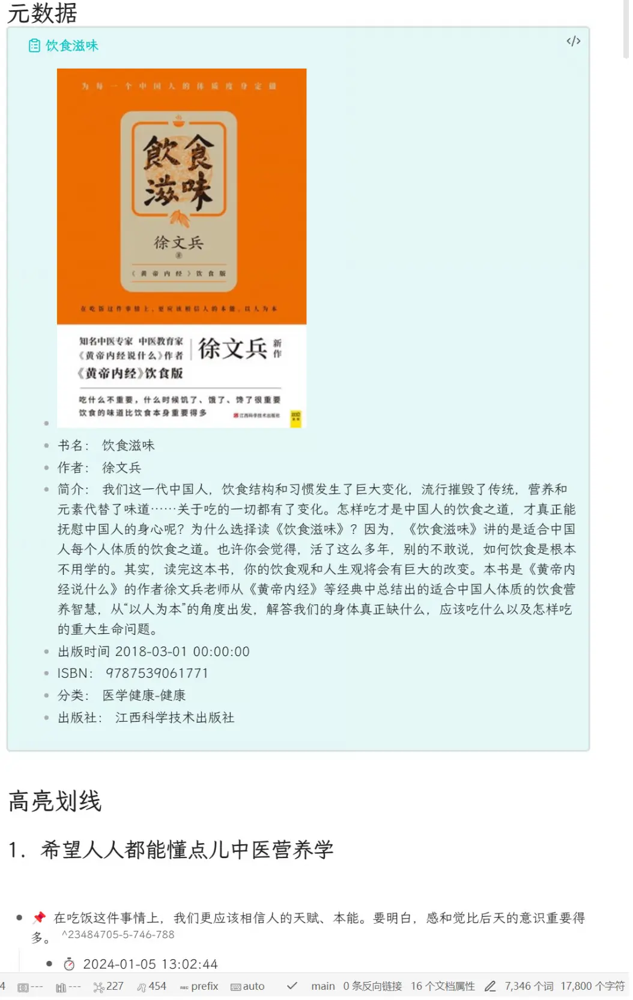

# Organizing Existing Information

Once the structure is designed, it's time to organize existing information — notes, documents, ebook highlights, images, and so on.

I believe only two things matter at this stage: maintain consistency, and keep recording and iterating.

## Maintain Consistency

Consistency is key to building an effective second brain. Maintain consistency throughout the entire structure and usage process — use similar naming conventions, tags, and categorization methods.

Across the many projects I've worked on, regardless of scale, a consistent directory structure and file naming convention has been crucial for project progress and team collaboration. This takes time to develop as a habit — don't overlook these details just because a project is small. As the number of projects grows, if you haven't done this, you'll face a mess of disorganized data whether you're archiving or trying to recycle reusable assets.

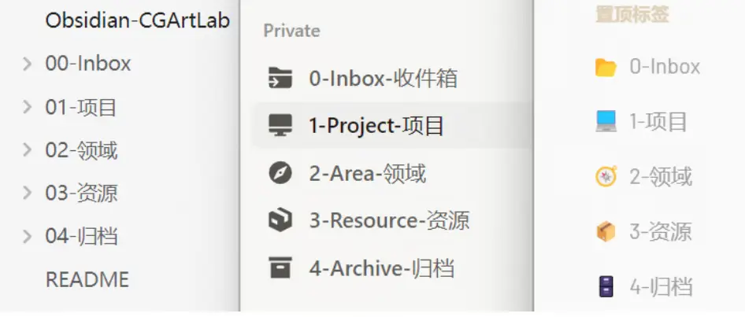

When you maintain this consistency across tools and even your computer's hard drive, you'll gradually realize the benefits:

1. **Improved efficiency and predictability**: Consistency establishes clear workflows and standardized methods. When all information and operations follow uniform standards, efficiency improves and confusion and errors decrease. It also makes workflows more predictable, increasing stability and control.
2. **Enhanced professional image and brand recognition**: This is a bonus effect. Consistency helps shape a professional image and brand identity. When information and work present a unified style, language, and visual effect, it leaves a stronger impression and boosts your personal or team brand value and influence. Consistency also builds user trust and loyalty, promoting long-term brand success.
3. **Better user experience and satisfaction**: This applies to the content you output, if any. Consistency improves the quality and readability of your output, making it easier for your audience to understand.

## Keep Recording, Iterate Responsively

Finally, persistence is the ultimate secret to building a second brain. As long as you keep recording and iterating, regardless of your workflow, you'll naturally start thinking about how to make the system better — instead of jumping back and forth between different note-taking apps.

Consistently investing time and energy means continuously updating and maintaining your second brain. This includes adding new information, adjusting structure and layout, and cleaning up expired or useless content. A continuous improvement mindset means constantly seeking opportunities to optimize — learning from external feedback, market changes, and technological advances. Through ongoing reflection and adjustment, the system stays responsive, evolving with your needs and environment.

# Summary

In this article, I've shared how, as a designer, I've evolved and refined my second brain system over time.

- **Evolution of the idea**: The journey from seeing the second brain as a tool, to a system, to a mindset.
- **Design approach**: A detailed look at how I adapted established frameworks to design a knowledge management system that fits my work and life.
- **Customizing tools**: Two examples from Notion and Obsidian. This might only scratch the surface, but I'm constantly exploring better tools and methods — and I'll continue sharing what I find.
- **Organizing existing information**: The best time to start is now. For something that benefits you for life, you need conviction, consistency, and responsive iteration. In truth, this applies to everything.

There's much more I'd like to share, but I'll stop here for now. If you're a designer, don't waste your craft. And if you're not, I'm glad my experience could be of help to you.
