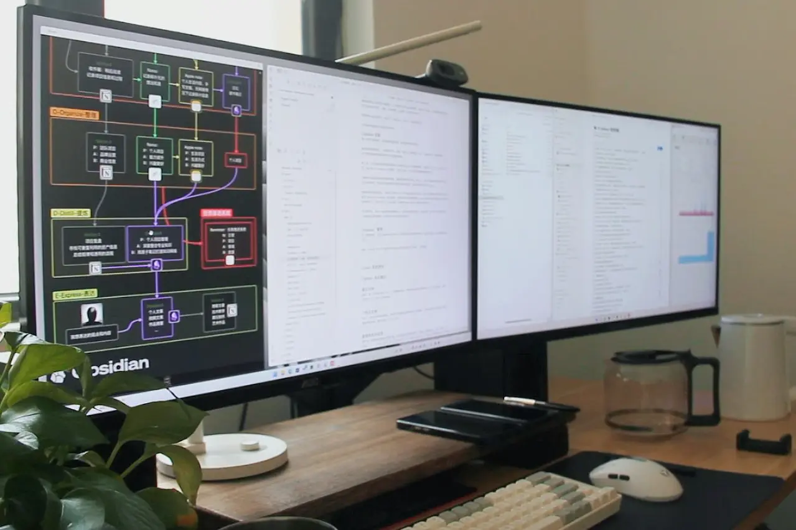

# 写在前面

在数字化时代，个人信息和想法的管理变得越来越重要。打造一个个性化的数字化第二大脑，成为了提高工作效率和创造力的关键。我将从理念到实践，介绍了如何设计和建立属于自己的第二大脑。

少废话，先放成果。

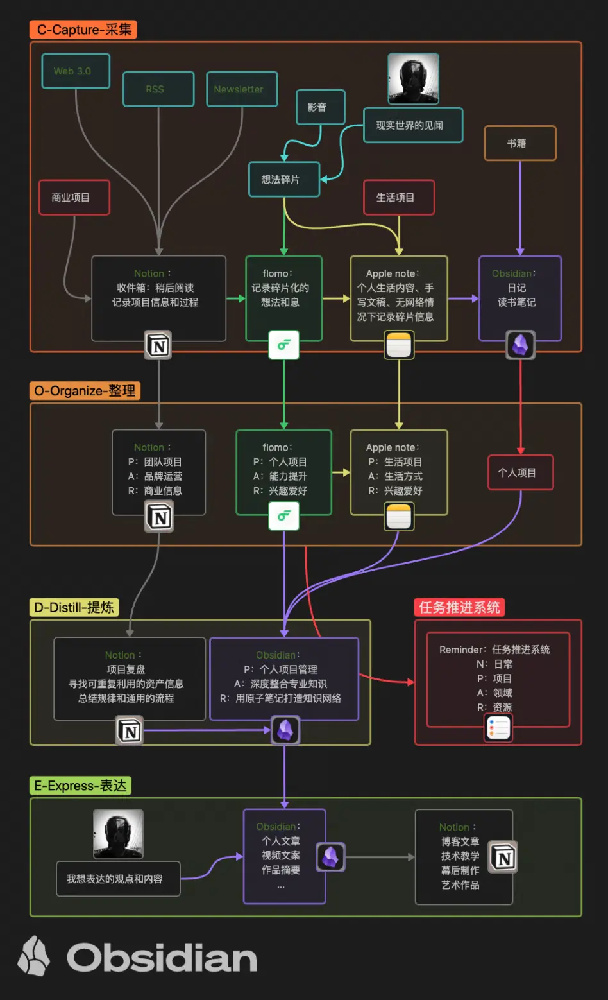

往期文章： [打造第二大脑](/posts/打造第二大脑/)

由于我的职业是一名自由设计师，对于成年累月的大规模项目资料和素材资源，以及学习笔记。越来越让我感到，在数字化时代设计师们面临着巨大的信息管理挑战。

我始终相信，专业素养的提升，往往来自专业之外。同时作为不同领域的设计师，每个人都有独特的工作流程和审美取向，如果你也是一名设计师，希望我的经验教训会对你有所帮助。如果从事其他职业，我想也一定能让你有所启发。或能帮助你选择称心如意的优雅工具，或能帮助你在设计自己的工作流中另辟蹊径。

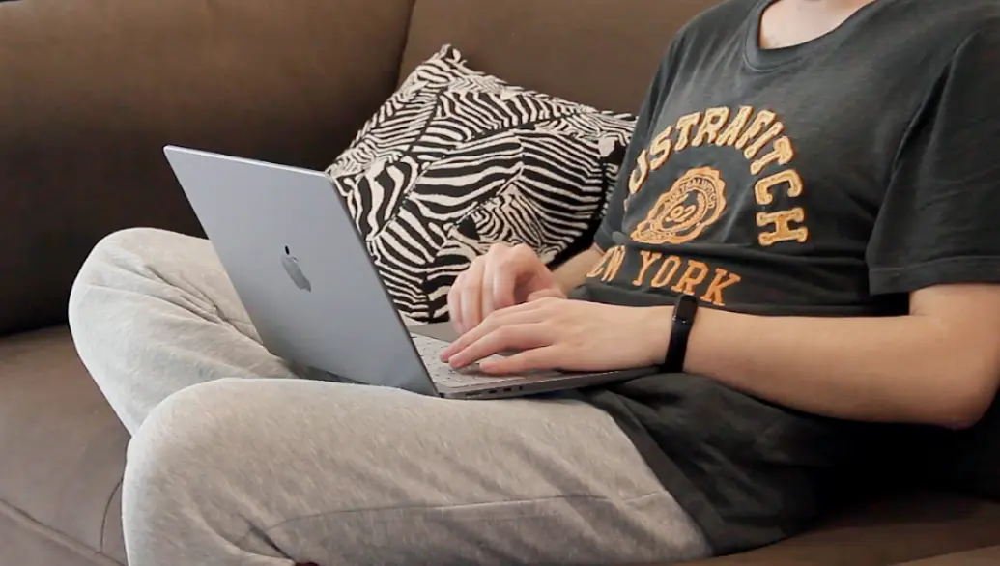

# 理念的进化路线

从去年第一次写文章介绍第二大脑，对它概念的理解我经历了三个阶段（角度）：**工具，系统，思维模式。** 现在，我意识到它不仅仅是一种工具，更是一种系统化的方法，并最终演化成一种思维模式，和我们的第一大脑时刻梦幻联动。

## 工具

最初我只用印象笔记，属于标准的“仓鼠症”晚期。看到什么都往里塞，也不做什么分类，实际上就是复制粘贴的工作。整个过程充斥着“收藏即学会”的虚幻满足感。现在想想看，印象笔记对我最有用的功能只有多平台同步而已。然而每个月吝啬的几十兆同步流量限制，臃肿缓慢的客户端逐渐让我对它失去兴趣。

然后，冲着无限同步流量，入坑了微软的 OneNote，但马上发现移动端体验很不友好，PC 端的 UI 也让我快速审美疲劳。撤。

后来跟风，切换到了 Notion，被它免费无限容量，优雅的界面，灵活又合理的布局吸引。当我准备把印象笔记里的内容全部导入进 Notion 里的时候。很讽刺地发现，当初无脑复制的内容是有多么无足轻重，很多都是微博上艺术博主介绍艺术家的作品图片。

工具也就是软件，本质是一种用来管理和整理信息的数字平台。我专注于选择合适的工具，学习如何使用它，并尝试将我的笔记、文档和想法整理成有序的结构。然而，随着我对第二大脑的使用不断深入，我开始意识到它远不止于此。

## 系统

第二阶段，我开始将第二大脑看作一种系统，一种用于处理和管理复杂信息的系统化方法。我不再局限于简单地收集和存储信息，而是思考如何构建一个更完整、更有机的知识体系。我着手重新设计我的第二大脑结构，创建更丰富的分类和标签体系，以更好地反映不同信息之间的关联和联系。

在这个阶段我尝试了更多的软件工具，最终剩下了 Notion，Obsidian，flomo，Apple 备忘录和 Apple 提醒事项。放弃了之前 AIO 的执着，专业的事项交给专业的工具。

## 思维模式

如今，随着时间的推移，各个工具的数据信息慢慢在发生微妙的变化。我逐渐意识到第二大脑的真正价值不仅在于它所包含的信息和生长出的网络，更在于它所代表的一种思维方式。

然后步入了第三阶段，在前辈们总结出的规律中慢慢将方法论一步步向更适合自己工作流的方向修正。这个阶段，第二大脑已经变为了一种思维工具，用来组织，发散，关联，产生创意的框架。同时也不仅仅是作为一个单纯的数字笔记系统和知识管理工具了，它与工作和学习紧密结合，甚至直接用来解决问题、制定计划、发现新的创意。

# 设计思路

既然是设计师，自然会假设设计第二大脑是在自己给自己下单。第一步自然是，明确目标和需求。

## 明确目标和需求

你需要定义自己想要使用第二大脑来实现的目标和满足的需求，可以是知识管理、创意思维、项目规划等。当然也可以 all in one。

当我把工作生活上的一切工作流大刀阔斧精简一遍之后，剩下最终的核心流程非常简单：读取，编辑，输出。

只是，不同的任务下，操作的数据主体类型不同罢了。例如，记录想法，思维导图，例行会议，写作等操作的是文本；画画和设计操作的是模型，图片和视频偶尔会有音频。电脑里的常用文件其实也就这么几类，其他的工程文件和软件工具等，一般我只会在涉及回收利用和学习技能的场景频繁操作。纯粹工作用的东西我会用另一套方法去管理，说回知识管理。

基于我的需求，采用第二大脑的整体设计框架是：**CODE**，即 **Capture（采集），Organize (分类管理)，Distall（萃取提纯），Express（表达输出）**。（源自 Tiago·Forte 的《Building Second Brain》）随手我也写下了每个阶段决定使用的工具。

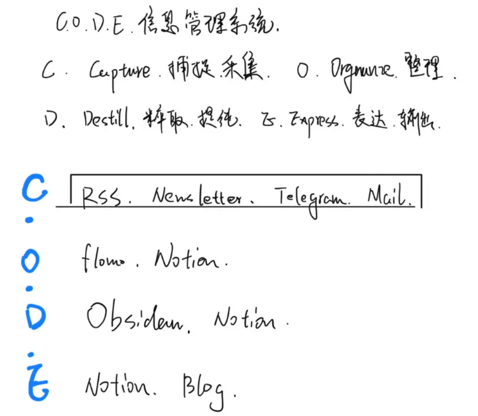

画画的手，字不好看，见谅。

这条记录是在去年了，和如今实际的情况有些出入，仅仅是当时随手一记，思路还远不成熟。

## 选择合适的工具

选择合适的工具是至关重要的，工具贯穿了整个过程的效率，质量以及体验。在选择前需要了解不同工具的设计理念，功能，适用场景，美观度（设计师职业病）。

我使用的工具目前有：Notion，Obsidian，flomo，Apple 备忘录。

下面我按照整体设计框架分别介绍。

## Capture 采集

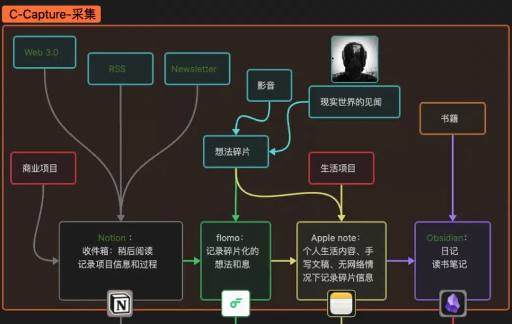

第一步是采集信息，这些信息分两大类，我看到的和我想到的。

看到有价值的信息，一般来源于书，影音，网络，社交媒体，RSS，Newsletter，新闻媒体。

这个顺序也是按信息类型的平均质量来排的。

除了书，这个阶段的其他信息收集我一般会用 Notion 的剪藏插件，收录到 Notion 中的 Inbox 页面，统一用一个 database 来管理，不进行特别的分类，只记录是否重新看过的状态。总体来说充当一个“稍后阅读”的功能。但它最主要的功能是记录工作项目，目前就不展开介绍了。

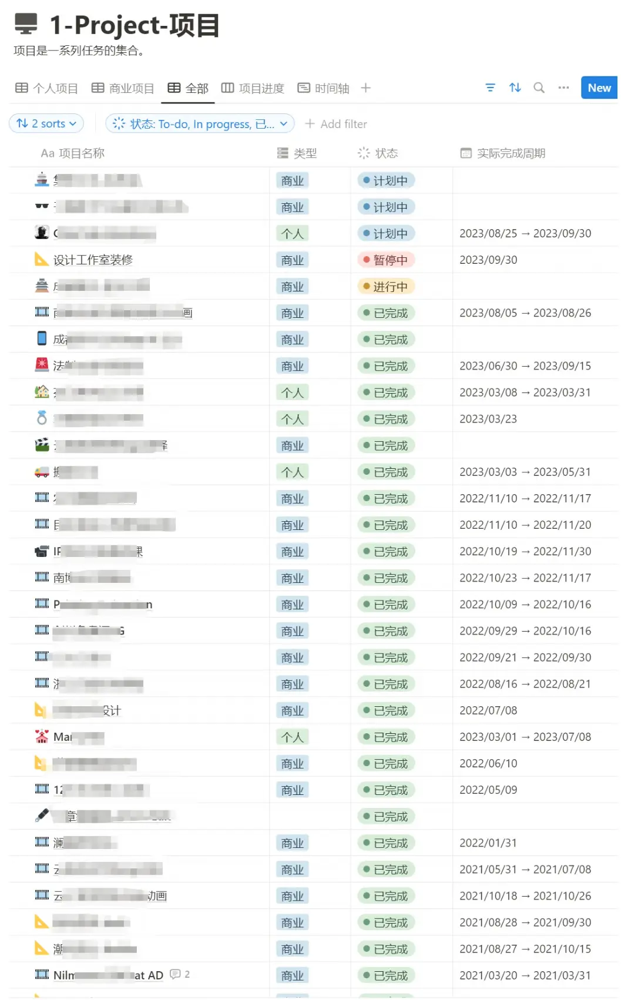

书籍我认为是最具参考价值的信息，需要花费整块的时间。形式上，电子书和纸质书我并不介意，各有各的好处。无论原文摘录和自己看完当时的想法，我会直接记录到 Obsidian。另外，Obsidian 还承担了每日记录的作用，这样可以让我明确感受到自己在向着目标前进。

我想到的有价值信息，更多来自于现实世界。一般会记录到 flomo 和 Apple 备忘录里面。flomo 的轻量化和全平台同步功能比 Notion 和 Obsidian 要好很多，更适合国内的网络环境。Apple 备忘录更方便我可以在没有网络的情况下（比如飞机和火车上）安心记录，或使用 apple pencil 随手写写画画。

说句题外话，现在一谈到信息的摄取输入，必然谈起算法推荐、信息茧房。我不是十分排斥算法，凡事客观上都有两面，太过或太少反而是不太好的。

## Organize 分类和管理

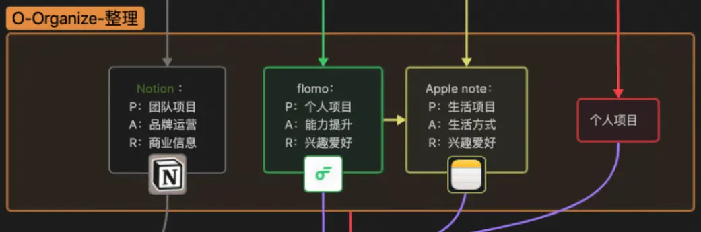

到了分类管理阶段，我不仅要考虑工作和个人知识管理本身的内容特性，还会结合每个工具的特性进行优化。

这个阶段我使用的是经典的 P.A.R.A 框架，即：

>  **Project 项目**：工作或者生活中正在从事的短期活动，带有明确的目的，时间范围。
>  **Area 领域**：长期致力的事项，做的好会对他人有益，同时自己要负责的事情。虽然不会设定具体的目标，但每个领域都要有坚持的标准。
>  **Resource 资源**：具有潜在参考价值的信息，可以是兴趣话题，研究课题，参考信息，个人爱好。
>  **Archive 归档**：以上三种信息处于休眠的状态，可以是完成或取消的项目，不再介入的领域，边缘化的资源。

了解 P.A.R.A 之后，作为设计师的工作流，我将其每个类别归类为下面这张图。其中归档的部分由于我使用的是自己的 NAS，独具一套更适合我的管理机制，因此这一阶段不考虑它。

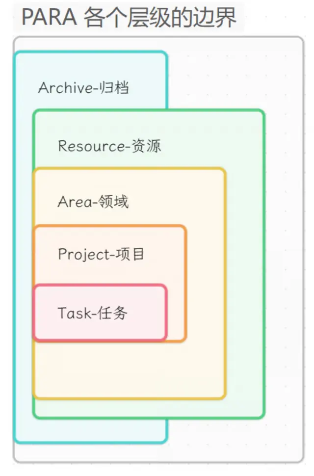

例如，Notion 除了可以随时同步信息之外也更善于协作分享。负责承载商业合作项目，品牌运营的管理最适合不过。flomo 主要用于记录碎片想法和现实中的信息，因此更加个人化。所以，分类为个人项目，能力提升和兴趣爱好。Apple 备忘录则更加私密，完全和工作无关。因此用来记录生活项目和兴趣爱好。

## Distill 萃取提纯

接下来就到了将信息进行萃取提炼的阶段。其中 Notion 进行项目复盘，回收利用项目资产，总结工作流中的规律，减少和尽量避免重复的工作量，从而提升效率。Obsidian 负责个人项目管理，深度整合专业相关的知识结构，建立越来越完整的知识结构网络，这样做最大的好处是让新的知识可以更快速地融入进来。

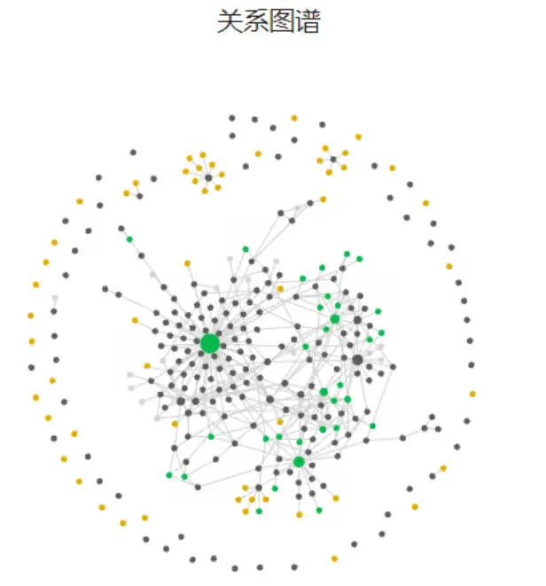

任务推进系统我也放在了这里，只使用苹果自带的提醒事项。一方面它可以多平台同步，另一方面可以和日历应用联动。将信息提炼之后任何项目都可以分解成单个的可执行的任务。

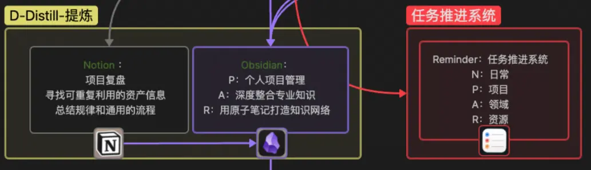

## Express 表达输出

经过前面几个过程，将自己认为有价值的发现和思考，整理归纳并用通俗易懂的方式制作成各种内容，便是表达和输出。

在这个阶段，主要输出的内容有文章，视频脚本，作品介绍等，这些我使用 Obsidian，因为其更注重本地数据的管理。同时配合 Git 用来同步和备份也很适合。

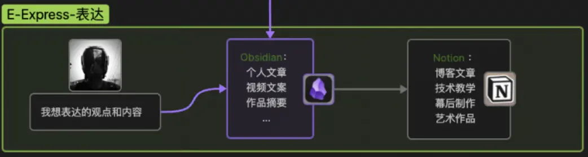

而需要公开发布的博客文章、技术教学、幕后制作和绘画作品等，我使用 Notion。这些内容更主要的目的是为了分享，加上 Notion 自身界面美观，排版灵活，阅读体验也相对更舒适。但相比华而不实的外表，更重要的是整体的内核结构设计。

# 建立结构

接着，建立结构是关键。实际上就是前面讲到的将第二大脑看作一个思维工具。用这个思维工具设计出来的结构，能够帮助我更好的组织和管理我的内容，也更加灵活，不会被某个工具限制。我始终相信：**铁打的数据，流水的程序。**

从那张整体的结构图很容易能看出来，我为自己设计的这套结构，遵循纵向为 C.O.D.E，横向为 P.A.R.A。

C.O.D.E 从纵向贯以线性穿整个第二大脑从输入到输出的过程，P.A.R.A 则从横向贯穿到每个工具中的分类形式，用来给最小单位的信息进行归类管理。这些都和使用什么工具无关，即便把 Obsidian 换成 Windows 写字板、Word，或是 VisCode 都没有关系。

# 个性化定制工具

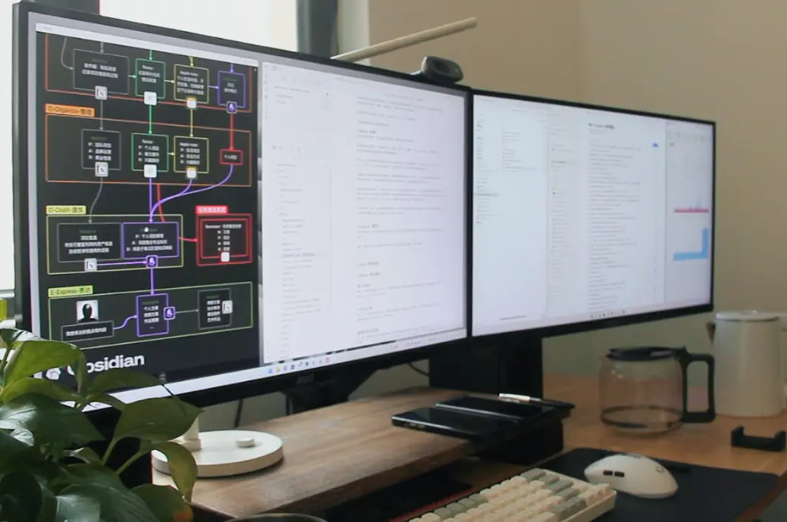

个性化定制当然是必要的。你也一样可以根据自己的喜好和工作流程，个性化定制自己的工具。这里我举几个例子可以参考：

## Notion

Notion 中我使用两个自定义的 database 分别管理发布的文章和作品，然后使用 Super 来搭建个人网站，虽然不是主站，更多是起到一个备份的功能。

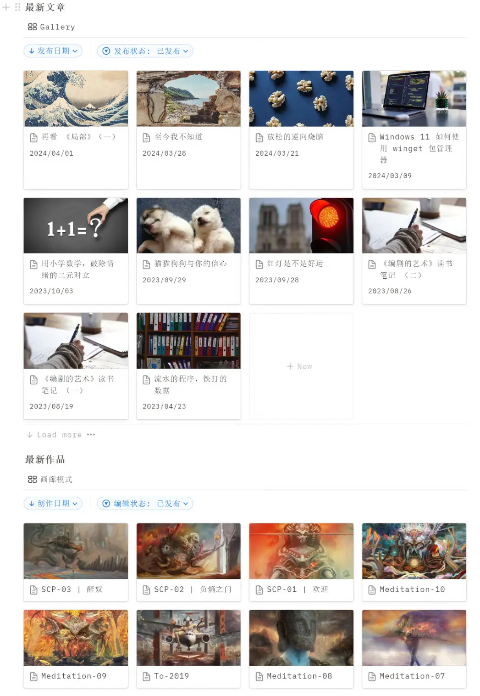

## Obsidain

Obsidian 中的个性化设置当然是用丰富的插件来实现，作用最大的是 Git，Calender，Projects 和 Weread。Git 不再赘述，Calender 主要用于每日记录，Projects 用来管理无需分享的个人项目，Weread 用来同步微信读书中的高亮划线段落语句。

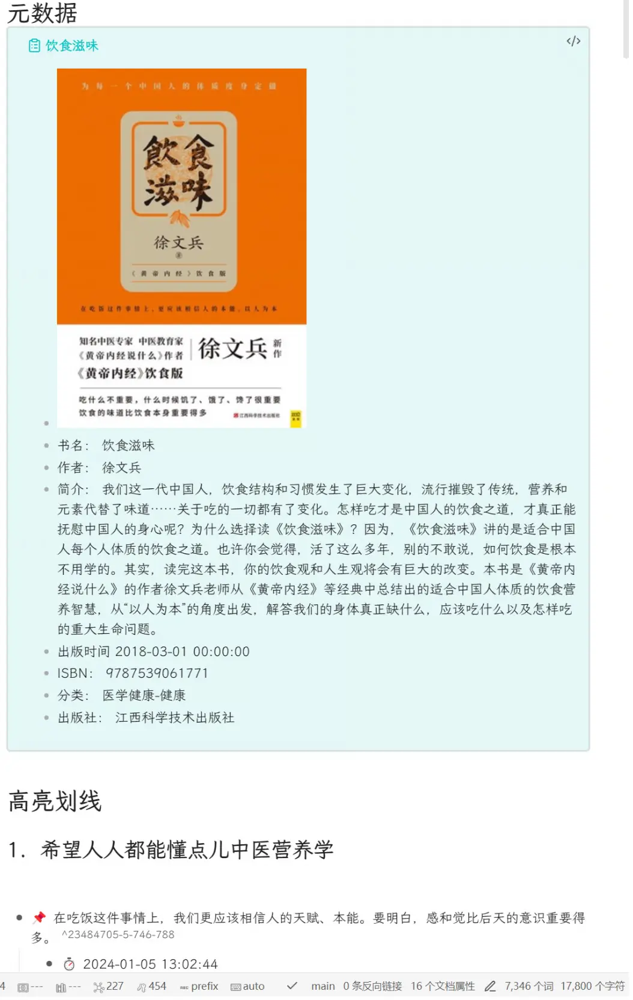

# 整理现有的信息

设计好完善的结构，接下来需要整理现有的信息。也就是我现有的笔记、文档、电子书高亮、图片等。

这一步我认为只需要做到最基本的两点即可：保持一致性和持续不断记录，灵敏迭代。

## 保持一致性

保持一致性是建立有效第二大脑的关键。在整个结构和使用过程中保持一致性，使用相似的命名约定、标签和分类方法。

在之前做过的众多项目中，无论项目的规模大小，一致的文件目录结构和文件命名方式对项目的推进和团队配合产生至关重要的作用。这需要长时间去养成良好的习惯，不要因为项目小去忽略这些细节。当做的项目数量逐渐增加之后，如果没做好这一步，无论整理归档还是回收可重复利用的资源，你都会面对一堆杂乱无章的数据无从下手。

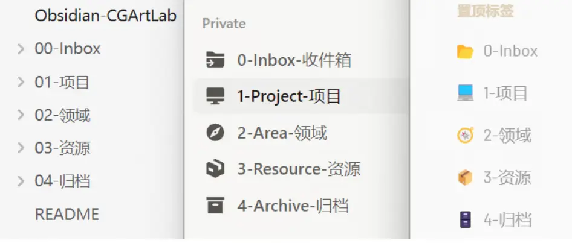

当你可以将各个工具中，甚至电脑硬盘中保持这种一致性，会逐渐意识到这样做的好处：

1. **提高效率和可预测性**：保持一致性可以帮助确立清晰的工作流程和标准化的操作方法。当所有的信息和操作都按照统一的标准进行管理和执行时，可以提高工作效率并减少混乱和错误。此外，一致性还使得工作流程更加可预测，提高了工作的稳定性和可控性。
2. **增强专业形象和品牌认知度**：这算是一项附加效果。一致性有助于塑造个人或团队的专业形象和品牌认知度。当信息和作品呈现出统一的风格、语言和视觉效果时，可以给人留下更加深刻的印象，并提升个人或团队的品牌价值和影响力。一致性还可以增强用户对品牌的信任和忠诚度，促进品牌的长期发展和成功。
3. **提升用户体验和满意度**：这一点是对于你将输出的内容，如果有的话。一致性可以提升输出内容的质量和易读性，使读者更加轻松地理解你的内容。

## 持续不断，灵敏迭代

最后，持之以恒是打造第二大脑的终极秘诀。只要去持续记录和迭代你的第二大脑，无论你的工作流是什么，你会自然而然地去开始思考如何让这个系统做到更好，而不是在各种笔记软件中反复横跳。

持之以恒地投入时间和精力意味着不断地更新和维护第二大脑。这包括添加新的信息、调整结构和布局、清理过期或无用的内容等。持续改进的态度意味着不断寻求改进和提高的机会，经常从外界的反馈、市场变化、技术进步等方面寻找优化第二大脑的方法。通过不断地反思和调整，使这套系统持续保持灵敏和与时俱进，更好地适应自己的需求和环境的变化。

# 总结

这篇文章，我分享了作为一名设计师自己是如何在打造第二大脑的过程中不断进化完善这套系统的过程。

- 理念的进化：对第二大脑的认识从工具到系统再到思维模式的转变。
- 设计思路：详细展示了我是如何根据前辈的优秀思想来设计定制符合自己工作生活的知识管理思维。
- 个性化定制工具：举了 Notion 和 Obsidian 中的两个例子，虽然可能管中窥豹，但我也在不断努力去进步，发现更好的工具和使用方法，试过之后觉得不错自然会继续分享给你。
- 整理现有的信息：做一件事最好的时机就是现在，做一件受益终生的事，自然需要有坚定的信念始终如一，持续不断，灵敏迭代。实际上任何事都是符合这一规律。

除了以上这些，还有很多我认为值得分享的内容。先写到这里吧，如果你也是一名设计师，不要浪费这门手艺。如果你不是设计师，我也很高兴自己的经历可以帮助到你。