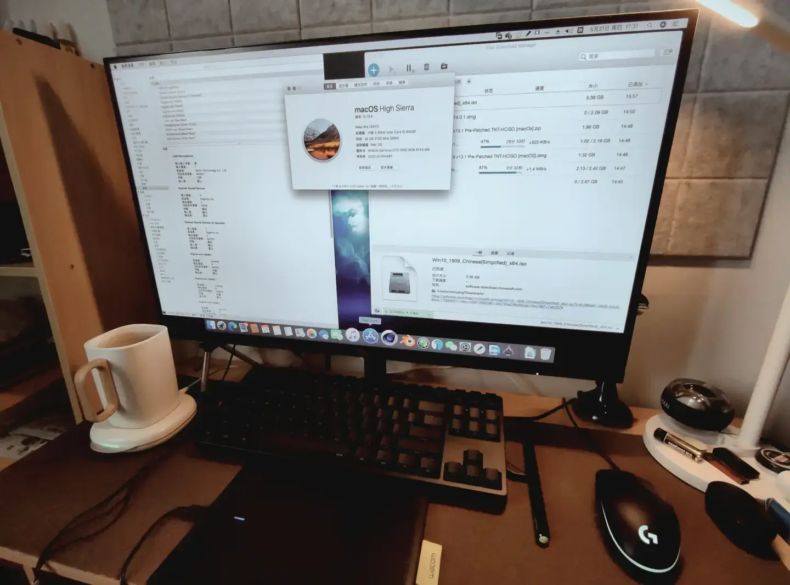

## Foreword

I picked up a Beelink SER5 Max mini PC at the end of September. After three months of heavy use, it's been dialed in to my liking.

I'd wanted a Mac mini for development and testing for a while — my MacBook Pro's 16GB of RAM just wasn't cutting it. If you follow the mini PC market, you might ask: why choose a two-year-old model when the brand-new M4 Mac mini just launched?

Simple. It comes down to needs:

- As far as I know, this is the AMD mini PC with the most mature and stable Hackintosh solution.
- 
- I've been tinkering with Hackintosh for years — built a dual-platform desktop setup (now at my parents' place as a backup workstation) that I still update occasionally. I still browse forums and Discord from time to time, and recently discovered that AMD support made big strides, including integrated GPU drivers, with open-source bootloader configs available.
- Extreme value for money. My build with 32GB RAM + 1TB + 2TB SSDs cost just over . A comparable Mac mini would run ,300+. I'd rather save that for a next-gen NVIDIA GPU for my desktop.
- I already have a powerful desktop workstation, and I don't game.
- Had a spare 27" 4K monitor lying around — too good to sell.
- Windows offers more freedom and expandability. It can double as a TV box (it already can, anytime) or a small server.

So I placed the order.

Let me be clear: unless you have specific **macOS** software or development/design needs, **neither a real Mac nor a Hackintosh should be on your radar**.

## Hardware Specs

The device is compact and well-built. I picked the gray version. After heavy use, dust is already collecting on the top air intake. But as a designer, I just couldn't stomach the bright red power button on the black model.

It's thin enough to fit under a monitor stand alongside a 68-key keyboard.

Specs:

| Component | Model | |
|-----------|-------|---|
| CPU | AMD 5800H | |
| GPU | AMD Radeon RX Vega 8 | |
| RAM | JUHOR 16GB DDR4 3200MHz x 2 | |
| SSD 1 | Galaxy Xingyao X4 Pro M 1TB | |
| SSD 2 | Colorful CF500 2TB | |

Looking at the [detailed CPU benchmarks](https://www.notebookcheck.net/AMD-Ryzen-7-5800H-Processor-Benchmarks-and-Specs.512759.0.html), the 5800H has 8 cores and 16 threads on a 7nm process. It's sufficient for my needs. Power-efficient? Not really — you can adjust that in the BIOS. This is my first AMD processor, and I was surprised to see idle temps of 50+ degrees in winter. That's not exactly low. Open a few browser tabs and the fan easily spins past 2500 RPM. So I made some optimizations before setting up the dual-boot system.

## Power and Noise Tuning

1. Enter BIOS
2. Under Advanced, find Smart Fan Function
3. In Smart Fan Function, find Smart CPU Fan Mode and select Automatic Mode
4. Change Fan start PWM to 50, PWM SLOPE SETTING to 2 PWM, and Fan full speed temperature limit to 80

These settings keep the default 54W full-performance mode (so it can still hit max speed when needed) while significantly reducing fan noise under light load. The trade-off is higher idle temps (55-65 degrees). Mini PCs aren't bothered by heat — it can't hurt the machine, and it's not me getting hot. What I care about is fan noise.

If the idle temps bother you, you can create a new power plan in the Control Panel and disable CPU turbo boost in advanced power settings — effectively setting CPU max performance from 100% to 99%. Note that this will cost you 5-10% of single-core performance. (macOS has a similar adjustment, but I need full power for development, so I skip it.)

## Adjusting VRAM for Integrated Graphics

I wouldn't recommend setting this above 8GB. The iGPU's VRAM is actually system RAM, and since this machine uses DDR4, setting too much VRAM can actually hurt performance.

## Installing Windows 11

If you bought the barebones version like I did, you'll need to install the OS yourself. Windows installation is straightforward, so I won't bore you with the details. If you've read this far, I trust you can handle it.

One thing worth mentioning: the system comes with a USB installation drive in the box, version 23H2, containing all the official hardware drivers. One-click installation, very convenient.

## Installing macOS

Before installing macOS, partition your disk. I split the 1TB NVMe SSD in half for system drives. When installing Windows 11, it automatically creates a 200MB EFI boot partition. I recommend expanding this to 300MB.

The image shows my partition layout under macOS Disk Utility. disk0s3 is the Windows 11 partition. To resize partitions, use DiskGenius or other tools within Windows 11.

### Preparation

- A working Windows PC
- macOS system image
  - You can create your own image or download a pre-built one-click installation image. The more well-known ones come from Daliansky (黑果小兵). My bootloader config is based on his work.
- OpenCore bootloader
  - You can use my config directly: <https://github.com/cgartlab/Beelink-SER5-Max-Hackintosh>, or find one that suits you better online.
  - **Warning: I'm using the stock Intel AX200 wireless card. Internet works fine, but AirDrop, Sidecar, etc. won't work (I don't use them). If you need those features, buy an Apple-compatible wireless card.**
- A spare 16GB USB drive

### Creating the Installation USB

There are many tools for writing the image. I recommend [balenaEtcher](https://www.balena.io/etcher) — it's open source and free.

It supports Windows, macOS, and Linux. Just download and use it.

The process is simple: select the image, select the USB drive, and write. It takes about ten minutes.

### Booting from USB

Press \del\ or \F7\ during boot to enter BIOS or the boot menu, then select the USB drive.

If everything goes well, you'll see the installation options.

Proceed with a normal macOS installation. The bootloader config currently supports Sequoia, but I chose Ventura for stability. After installation, you can update to 13.7.1.

When formatting disks, keep the system partition as APFS. If you have a SATA SSD (like I do), format it as exFAT so both systems can share a common storage drive with read/write access.

**Important: Don't sign in to your Apple ID yet** — you'll need to modify the system serial number first.

### Replacing the Bootloader

Download [OC AuxiliaryTools](https://github.com/ic005k/OCAuxiliaryTools) — the key tool for modifying and replacing bootloader configs, essential for macOS to work properly.

After installing and opening it, go to the menu: Edit > Mount ESP > USB drive > Mount.

Remember, you're currently booted from the USB drive, so the boot partition you're modifying is on the USB. To get dual-boot working, you need to merge the macOS and Windows 11 boot files.

Open Finder, copy all files from the USB drive's EFI partition to the system's EFI partition. Now you can remove the USB drive. If you encounter boot issues later, you can still use the USB drive to boot.

### Updating Drivers and Bootloader

In the menu bar: Edit > Mount ESP > System drive > Mount and open the config file.

First, set a system serial number. Generate a random one and check on Apple's website to make sure it's valid.

Then select "Update OpenCore and kexts." OpenCore is the core bootloader component, and kexts are hardware driver files.

Check for Kext updates. Files with available updates will show a red square. Check them and update. I don't recommend using development versions of drivers.

After updating, save the EFI file and exit.

### Rebuilding Cache and Repairing System Permissions

Download and install [Hackintool](https://www.baker76.com/hackintool/).

First, go to the "Power" tab and check if the sleep/wake parameter is set to "0". If not, click the screwdriver button to fix it, ensuring the system can wake from sleep properly.

Then go to the Tools tab, click the white square in the bottom-right corner, enter your system password, and confirm. This fixes system permissions and driver caches. This approach is generally the most reliable.

Finally, restart and select macOS. You should now be able to sign in with your Apple ID normally.

## Results and Software Compatibility

System info.

This is what it looks like as I'm writing this article.

Software compatibility — at least for the software I use (shown below), I haven't experienced any crashes or restarts (except when I broke things myself).

## Summary

The right tool for the right job. The key value of choosing what you need and customizing it is:

1. **Precise fulfillment of needs**: Everyone's work and life scenarios are different. I have needs for development testing, multi-OS usage, and utilizing spare hardware. Choosing and configuring based on actual needs ensures the device aligns perfectly with your requirements in performance and functionality, avoiding wasted resources or missing features. For development work, sufficient RAM (like the 32GB I configured) and system stability (through careful installation and optimization) are critical. For daily entertainment or backup use, Windows' freedom and expandability shine — the device can double as a TV box or small server.

2. **Optimized cost-effectiveness**: Hardware prices vary dramatically with different configurations. The official Mac mini with similar specs costs much more than my DIY approach. By choosing based on needs, I found the most cost-effective combination. Using an AMD mini PC and configuring storage myself, I achieved a similar or even better experience at a fraction of the cost of a high-priced device — maximizing bang for the buck.

3. **Better experience and flexibility**: Personalized configuration lets you fine-tune performance to your preferences — optimizing power/noise, adjusting VRAM, etc. — making the device behave exactly how you want. Dual-boot (Windows 11 + macOS) provides maximum flexibility, letting you switch between systems for different tasks, seamlessly bridging work and entertainment environments, and leveraging each system's strengths.

4. **Technical exploration and ownership**: This process pushed me to deeply understand hardware and software — BIOS settings, disk partitioning, bootloader configuration, and more. Through research and hands-on practice, I solved real problems, gained a sense of control over my device, and strengthened my technical foundation for future challenges.

I hope my experience helps others navigate device selection and configuration with fewer detours, better meeting their work and usage needs.

References:

- <https://heipg.cn>
- <https://blog.daliansky.net>
- <https://post.smzdm.com/p/a8p7k0m6/>
- <https://github.com/cgartlab/Beelink-SER5-Max-Hackintosh>

Originally published on [CGArtLab](https://cgartlab.com)